# CSS Guide Part 2

 Detailed guide about CSS (all basics for CSS).

 Part 2 contains : The box model of CSS and CSS positioning (Flexbox).

 The code examples in the guide can be found in the listed folders.

 -----------------------------------------------------------------------------------------

## Contents
### [CSS Guide Part I](https://github.com/BellaMrx/CSS_Guide)
1. Introduction to CSS
    - 1.1. History of CSS 
    - 1.2. Principle of CSS application
    - 1.3. Embedding CSS into HTML
    - 1.4. Analyze CSS in the web browser
2. The CSS selectors
    - 2.1. The simple selectors of CSS
    - 2.2. Combinators
3. Inheritance and the cascade 
    - 3.1 The principle of inheritance in CSS
    - 3.2. Understanding the control system of the cascade
    - 3.3. Pass values to CSS properties
### CSS Guide Part II
4. The box model of CSS 
    - 4.1. The classic box model
    - 4.2. The newer alternative box model of CSS
    - 4.3. Design boxes
    - 4.4. CSS Vendor Prefixes
5. CSS positioning
    - 5.1. Positioning with the CSS property `position`
    - 5.2. Stacking with `z-index`
    - 5.3. Floating boxes with `float`
    - 5.4. Flexible boxes (flexbox model)
### [CSS Guide Part III](https://github.com/BellaMrx/CSS_Guide_Part_3)
6. Responsive layouts with CSS
    - 6.1. Theoretical basic knowledge about responsive web design
    - 6.2. Create a responsive layout
    - 6.3. Responsive layouts with images
    - 6.4. The CSS Grid Layout
    - 6.5. Change the behavior of HTML elements with `display`
    - 6.6. Calculation with CSS and the `calc()` function
### [CSS Guide Part IV](https://github.com/BellaMrx/CSS_Guide_Part_4)
7. Styling with CSS
    - 7.1. Text design with CSS
    - 7.2. Design lists with CSS
    - 7.3. Tables with CSS
    - 7.4. Images and graphics with `width` and `height`
    - 7.5. Transfom elements
    - 7.6. Style HTML forms with CSS
8. Testing and organizing
    - 8.1 Validate HTML and CSS
    - 8.2. View websites in different sizes
    - 8.3. Set up central stylesheet
9. Useful websites about CSS


---------------------------------------------------------------------------------

# 4. The box model of CSS
In CSS, the box model serves as the basis for positioning elements and creating a layout.


## 4.1. The classic box model
The box model includes:
- the actual **content** of text and images, which is specified with **width** and **height**
- **padding**, which creates space between the content and the border of an element
- the **border**
- **margin**, this creates space around an element, outside of paddings and borders 

 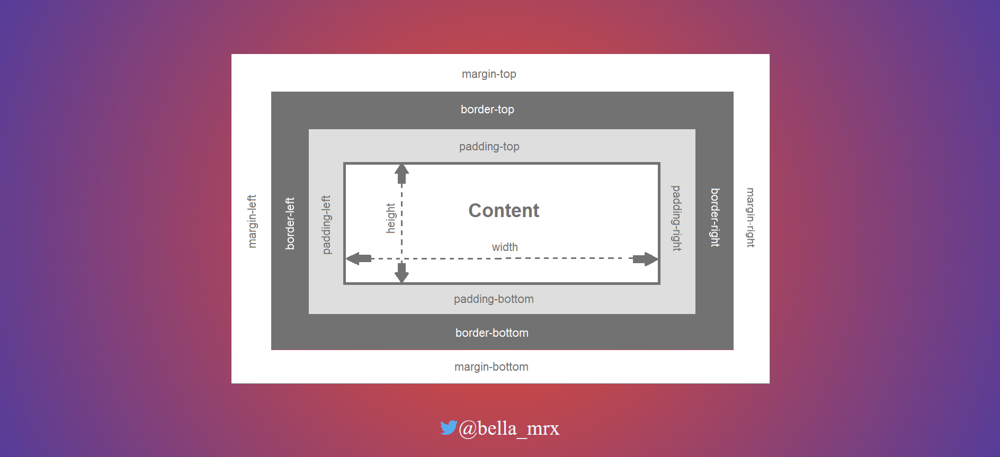


### width and height
The actual content area with the space for text and images can be specified with the CSS properties width and height. If no value is specified, the HTML element is as wide and high as the surrounding element.

 [Complete Code](https://github.com/BellaMrx/CSS_Guide_Part_2/blob/main/4_Box_Model/Part_1) --> *4_Box_Model/Part_1/index.html*
   ```
    <h1>width and height</h1>
    <article class="article_01">
        <h2 class="h_2">Article 1 (width: 300px)</h2>
        <p>
            Lorem <abbr>ipsum</abbr> dolor <em>sit amet</em>, consectetuer adipiscing elit. <strong>Aenean commodo</strong> ligula eget dolor.
            <a href="#">Aenean massa</a>. Cum sociis natoque penatibus et
            <ins>magnis</ins> dis parturient montes, nascetur
            <del>ridiculus</del> mus. Donec quam felis, <mark>ultricies nec</mark>, pellentesque eu, pretium quis, sem. Nulla consequat massa quis enim.
        </p>
    </article>
    <article class="article_02">
        <h2 class="h_2">Article 2 (width: 600px)</h2>
        <p>
            Lorem <abbr>ipsum</abbr> dolor <em>sit amet</em>, consectetuer adipiscing elit. <strong>Aenean commodo</strong> ligula eget dolor.
            <a href="#">Aenean massa</a>. Cum sociis natoque penatibus et
            <ins>magnis</ins> dis parturient montes, nascetur
            <del>ridiculus</del> mus. Donec quam felis, <mark>ultricies nec</mark>, pellentesque eu, pretium quis, sem. Nulla consequat massa quis enim.
        </p>
    </article>
   ```


 [Complete Code](https://github.com/BellaMrx/CSS_Guide_Part_2/blob/main/4_Box_Model/Part_1) --> *4_Box_Model/Part_1/styles/style.css*
   ```
    .article_01 { 
        width: 300px; background: #e7fad7; 
    }

    .article_02 { 
        width: 600px; background: #e7fad7; 
    }

    .h_2 { 
        background: #adfd93; 
    }
   ```

 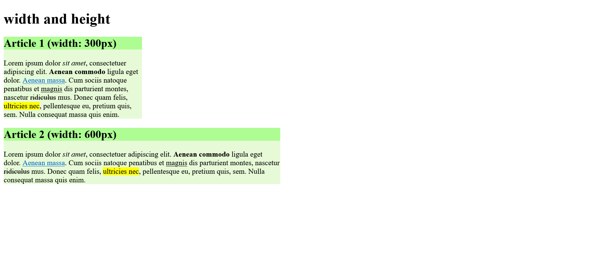


Note that the height specification is only an initial value. If the content of the encompassing element is greater than the specified height, the content will still be displayed and will overflow the box.

 [Complete Code](https://github.com/BellaMrx/CSS_Guide_Part_2/blob/main/4_Box_Model/Part_2) --> *4_Box_Model/Part_2/index.html*
   ```
    <h1>height</h1>
    <article class="article_01">
        <h2>Headline</h2>
        <p>
            Lorem ipsum dolor sit amet, consectetuer adipiscing elit. Aenean commodo ligula eget dolor. Aenean massa. Cum sociis natoque penatibus et magnis dis parturient montes, nascetur ridiculus mus. Donec quam felis, ultricies nec, pellentesque eu, pretium quis,
            sem. Nulla consequat massa quis enim. Donec pede justo, fringilla vel, aliquet nec, vulputate eget, arcu. In enim justo, rhoncus ut, imperdiet a, venenatis vitae, justo.
        </p>
    </article>
   ```


 [Complete Code](https://github.com/BellaMrx/CSS_Guide_Part_2/blob/main/4_Box_Model/Part_2) --> *4_Box_Model/Part_2/styles/style.css*
   ```
    .article_01 {
        width: 230px;
        height: 215px;
        background-color: #e7fad7;
        border: black 1px solid;
        /* overflow: hidden; */
    }
   ```

 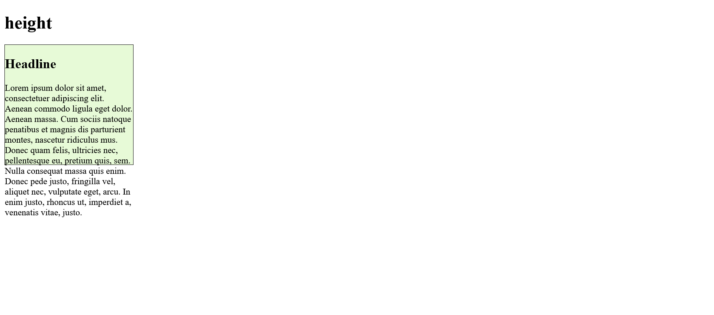


If overflowing is to be prevented, this is possible with the CSS property `overflow: hidden;`, with which, however, the oversized content is no longer displayed.

 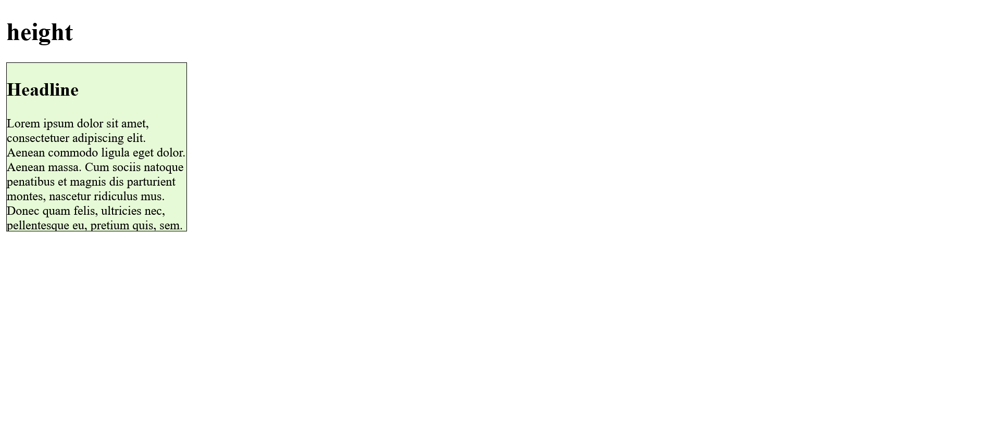


In practice, fixed values for width and height are rarely defined. Responsive web design tends to use properties such as `min-width` or `min-height` or `max-height` to allow flexible limits suitable for the device or screen width.


### padding
The CSS property padding alone sets all four sides clockwise, which is the shorthand notation:

   ```
    section { 
        padding: 20px;
    } 
   ```

is the shorthand notation of:
   ```
    section { 
        padding-top: 20px;
        padding-right: 20px;
        padding-bottom: 20px;
        padding-left: 20px;
    } 
   ```

The shorthand notation with padding works the same as with margin.


### border
The border wraps around the inner space (padding) and has its own CSS properties for thickness, line style, and color. Again, as with margin and padding, all four sides can be adjusted separately.

 [Complete Code](https://github.com/BellaMrx/CSS_Guide_Part_2/blob/main/4_Box_Model/Part_3) --> *4_Box_Model/Part_3/index.html*
   ```
    <h1>border</h1>
    <article class="article01">
        <h2 class="h_2">width: 600px; border: 10px solid sienna;</h2>
        <p>
            Lorem <abbr>ipsum</abbr> dolor <em>sit amet</em>, consectetuer adipiscing elit. <strong>Aenean commodo</strong> ligula eget dolor.
            <a href="#">Aenean massa</a>. Cum sociis natoque penatibus et
            <ins>magnis</ins> dis parturient montes, nascetur
            <del>ridiculus</del> mus. Donec quam felis, <mark>ultricies nec</mark>, pellentesque eu, pretium quis, sem. Nulla consequat massa quis enim.
        </p>
    </article>
    <article class="article02">
        <h2 class="h_2">width: 600px; border: 10px solid peru; padding: 50px;</h2>
        <p>
            Lorem <abbr>ipsum</abbr> dolor <em>sit amet</em>, consectetuer adipiscing elit. <strong>Aenean commodo</strong> ligula eget dolor.
            <a href="#">Aenean massa</a>. Cum sociis natoque penatibus et
            <ins>magnis</ins> dis parturient montes, nascetur
            <del>ridiculus</del> mus. Donec quam felis, <mark>ultricies nec</mark>, pellentesque eu, pretium quis, sem. Nulla consequat massa quis enim.
        </p>
    </article>
   ```


 [Complete Code](https://github.com/BellaMrx/CSS_Guide_Part_2/blob/main/4_Box_Model/Part_3) --> *4_Box_Model/Part_3/styles/style.css*
   ```
    .article01 {
        width: 600px;
        border: 10px solid #56d22d;
        background-color: #e7fad7;
    }

    .article02 {
        width: 600px;
        padding: 50px;
        border: 10px solid #76ea4f;
        background-color: #e7fad7;
    }

    .h_2 { 
        background-color: #adfd93;
    }
   ```

 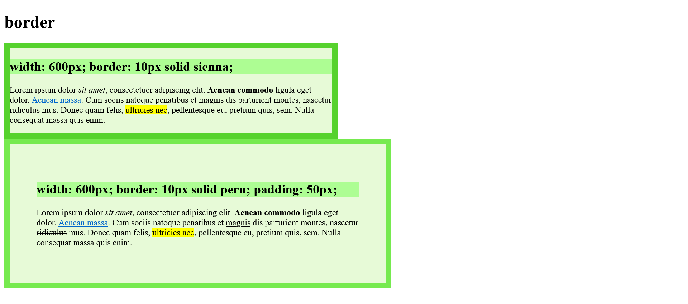


### margin
The outer spacing of the box model is called margin. The outer margin has no color, is completely transparent and therefore takes on the background color of the surrounding element. Negative values are also allowed for margin. How these affect margin depends on whether the elements are static, positioned or floated.

 [Complete Code](https://github.com/BellaMrx/CSS_Guide_Part_2/blob/main/4_Box_Model/Part_4) --> *4_Box_Model/Part_4/index.html*
   ```
    <header class="headfoot">Header</header>
    <article class="article01">
        <h2>margin: 10px 0px;</h2>
        <p>
            Lorem <abbr>ipsum</abbr> dolor <em>sit amet</em>, consectetuer adipiscing elit. <strong>Aenean commodo</strong> ligula eget dolor.
            <a href="#">Aenean massa</a>. Cum sociis natoque penatibus et
            <ins>magnis</ins> dis parturient montes, nascetur
            <del>ridiculus</del> mus. Donec quam felis, <mark>ultricies nec</mark>, pellentesque eu, pretium quis, sem. Nulla consequat massa quis enim.
        </p>
    </article>
    <article class="article01">
        <h2>margin: 10px 0px;</h2>
        <p>
            Lorem <abbr>ipsum</abbr> dolor <em>sit amet</em>, consectetuer adipiscing elit. <strong>Aenean commodo</strong> ligula eget dolor.
            <a href="#">Aenean massa</a>. Cum sociis natoque penatibus et
            <ins>magnis</ins> dis parturient montes, nascetur
            <del>ridiculus</del> mus. Donec quam felis, <mark>ultricies nec</mark>, pellentesque eu, pretium quis, sem. Nulla consequat massa quis enim.
        </p>
    </article>
    <footer class="headfoot">Footer</footer>
   ```


 [Complete Code](https://github.com/BellaMrx/CSS_Guide_Part_2/blob/main/4_Box_Model/Part_4) --> *4_Box_Model/Part_4/styles/style.css*
   ```
    .article01 {
        width: 600px;
        padding: 5px;
        border: 5px solid #76ea4f;
        background-color: #e7fad7;
        margin: 10px 0px;
    }

    .headfoot {
        width: 600px;
        padding: 5px;
        border: 5px solid #76ea4f;
        background-color: #adfd93;
        text-align: center;
    }
   ```

 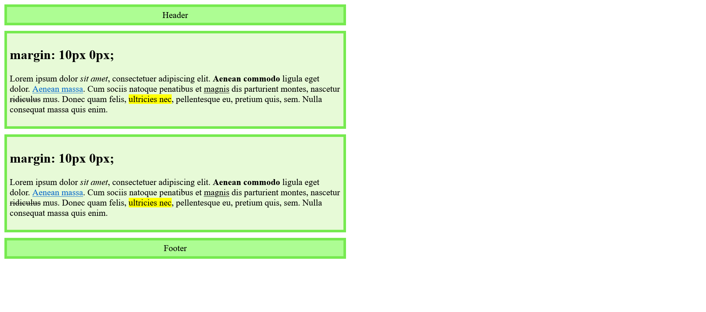


### Collapsing Margins
For the vertical margins of two boxes placed one above the other, the values are not added together, but only the larger of the two margins is used. The smaller value is ignored. Horizontal distances do not collapse. If they touch, they are added together normally.

 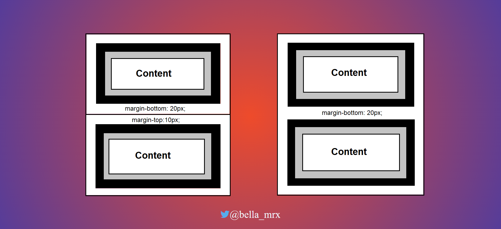

 [Complete Code](https://github.com/BellaMrx/CSS_Guide_Part_2/blob/main/4_Box_Model/Part_5) --> *4_Box_Model/Part_5/index.html*
   ```
    <header class="headfoot">Header</header>
    <article class="article01">
        <h2>Article 1</h2>
        <p>
            Lorem <abbr>ipsum</abbr> dolor <em>sit amet</em>, consectetuer adipiscing elit. <strong>Aenean commodo</strong> ligula eget dolor.
            <a href="#">Aenean massa</a>. Cum sociis natoque penatibus et
            <ins>magnis</ins> dis parturient montes, nascetur
            <del>ridiculus</del> mus. Donec quam felis, <mark>ultricies nec</mark>, pellentesque eu, pretium quis, sem. Nulla consequat massa quis enim.
        </p>
    </article>
    <article class="article01">
        <h2>Article 2</h2>
        <p>
            Lorem <abbr>ipsum</abbr> dolor <em>sit amet</em>, consectetuer adipiscing elit. <strong>Aenean commodo</strong> ligula eget dolor.
            <a href="#">Aenean massa</a>. Cum sociis natoque penatibus et
            <ins>magnis</ins> dis parturient montes, nascetur
            <del>ridiculus</del> mus. Donec quam felis, <mark>ultricies nec</mark>, pellentesque eu, pretium quis, sem. Nulla consequat massa quis enim.
        </p>
    </article>
    <footer class="headfoot">Footer</footer>
   ```


 [Complete Code](https://github.com/BellaMrx/CSS_Guide_Part_2/blob/main/4_Box_Model/Part_5) --> *4_Box_Model/Part_5/styles/style.css*
   ```
    .headfoot {
        width: 600px;
        padding: 5px;
        border: 5px solid #adfd93;
        background-color: #e7fad7;
        margin-bottom: 20px;
        text-align: center;
    }

    .article01 {
        width: 600px;
        padding: 5px;
        border: 5px solid #76ea4f;
        background-color: #e7fad7;
        margin: 10px 0px;
    }


    /* h1, h2, p {
        margin-top: 0;
    } */
   ```

 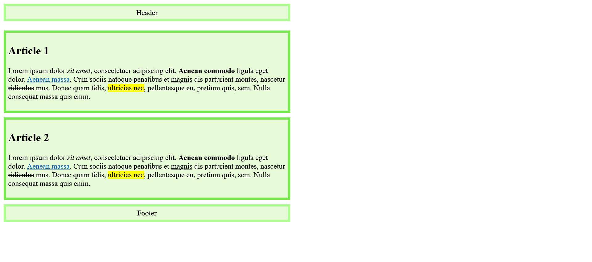

 
The collapsing is intentional and serves to keep the spacing even for texts that consist of multiple paragraphs. It rules:
- If both values are the same, only one is used.
- If the values are different, the larger value is used.


### Calculating the total width and height of a box
It is possible to calculate the total width or total height of a box.

 [Complete Code](https://github.com/BellaMrx/CSS_Guide_Part_2/blob/main/4_Box_Model/Part_6) --> *4_Box_Model/Part_6/index.html*
   ```
    <header class="headfoot">Header</header>
    <article class="article01">
        <h2>Article 1</h2>
        <p>
            Lorem <abbr>ipsum</abbr> dolor <em>sit amet</em>, consectetuer adipiscing elit. <strong>Aenean commodo</strong> ligula eget dolor.
            <a href="#">Aenean massa</a>. Cum sociis natoque penatibus et
            <ins>magnis</ins> dis parturient montes, nascetur
            <del>ridiculus</del> mus. Donec quam felis, <mark>ultricies nec</mark>, pellentesque eu, pretium quis, sem. Nulla consequat massa quis enim.
        </p>
    </article>
    <article class="article01">
        <h2>Article 2</h2>
        <p>
            Lorem <abbr>ipsum</abbr> dolor <em>sit amet</em>, consectetuer adipiscing elit. <strong>Aenean commodo</strong> ligula eget dolor.
            <a href="#">Aenean massa</a>. Cum sociis natoque penatibus et
            <ins>magnis</ins> dis parturient montes, nascetur
            <del>ridiculus</del> mus. Donec quam felis, <mark>ultricies nec</mark>, pellentesque eu, pretium quis, sem. Nulla consequat massa quis enim.
        </p>
    </article>
    <footer class="headfoot">Footer</footer>
   ```


 [Complete Code](https://github.com/BellaMrx/CSS_Guide_Part_2/blob/main/4_Box_Model/Part_6) --> *4_Box_Model/Part_6/styles/style.css*
   ```
    .headfoot {
        width: 600px;
        padding: 5px;
        border: 1px solid black;
        background-color: #adfd93;
        margin: 5px 0px;
        text-align: center;
    }

    .article01 {
        width: 600px;
        padding: 15px;
        border: 2px dotted #76ea4f;
        background-color: #e7fad7;
    }
   ```

 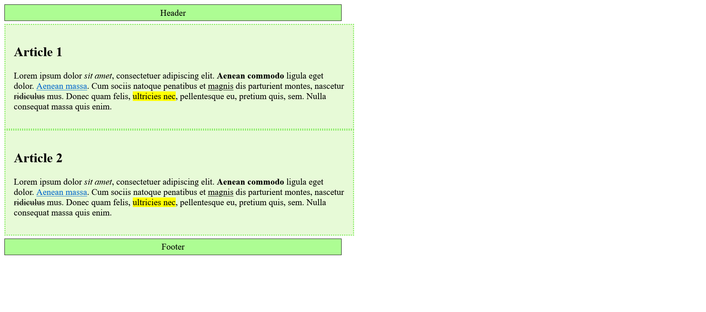


The total width of a box is calculated by adding width, padding-right, padding-left, border-right-width, border-left-width, margin-right and margin-left together.

Calculation for this example:
| CSS Property         | .headfoot | .article  |
| -------------------- | --------- | --------- |
| width      	  	   | 600 Pixel | 600 pixel |
| + padding-right 	   | 5 Pixel   | 15 Pixel  |
| + padding-left  	   | 5 Pixel   | 15 Pixel  |
| + border-right-width | 1 Pixel   | 2 Pixel   |
| + border-left-width  | 1 Pixel   | 2 Pixel   |
| + margin-right 	   | 0 		   | 0 		   |
| + margin-left 	   | 0 		   | 0 		   |
| **total width**      | 612 pixel | 634 pixel |

Thus the difference of the total width is exactly 22 pixels. Here you have to decide for yourself where to add or remove these 22 pixels. 

Example:

 [Complete Code](https://github.com/BellaMrx/CSS_Guide_Part_2/blob/main/4_Box_Model/Part_7) --> *4_Box_Model/Part_7/index.html*
   ```
    <header class="headfoot">Header</header>
    <article class="article01">
        <h2>Article 1</h2>
        <p>
            Lorem <abbr>ipsum</abbr> dolor <em>sit amet</em>, consectetuer adipiscing elit. <strong>Aenean commodo</strong> ligula eget dolor.
            <a href="#">Aenean massa</a>. Cum sociis natoque penatibus et
            <ins>magnis</ins> dis parturient montes, nascetur
            <del>ridiculus</del> mus. Donec quam felis, <mark>ultricies nec</mark>, pellentesque eu, pretium quis, sem. Nulla consequat massa quis enim.
        </p>
    </article>
    <article class="article01">
        <h2>Article 2</h2>
        <p>
            Lorem <abbr>ipsum</abbr> dolor <em>sit amet</em>, consectetuer adipiscing elit. <strong>Aenean commodo</strong> ligula eget dolor.
            <a href="#">Aenean massa</a>. Cum sociis natoque penatibus et
            <ins>magnis</ins> dis parturient montes, nascetur
            <del>ridiculus</del> mus. Donec quam felis, <mark>ultricies nec</mark>, pellentesque eu, pretium quis, sem. Nulla consequat massa quis enim.
        </p>
    </article>
    <footer class="headfoot">Footer</footer>
   ```


 [Complete Code](https://github.com/BellaMrx/CSS_Guide_Part_2/blob/main/4_Box_Model/Part_7) --> *4_Box_Model/Part_7/styles/style.css*
   ```
    .headfoot {
        width: 600px;
        padding: 5px;
        border: 1px solid black;
        background-color: #adfd93;
        margin: 5px 0px;
        text-align: center;
    }

    .article01 {
        width: 578px;
        padding: 15px;
        border: 2px dotted #76ea4f;
        background-color: #e7fad7;
    }
   ```

 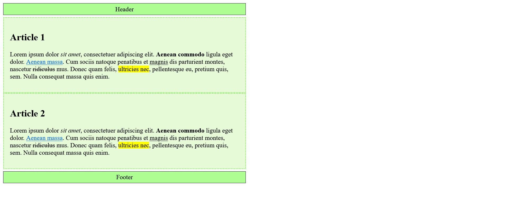


## 4.2. The newer alternative box model of CSS
The classic box model can be complicated, since the width specification determines the width of the content area and in the end padding, border and margin must also be taken into account for the total width. As long as the specification is only in pixels, a uniform layout is possible with awkward arithmetic.

It becomes more complicated when different units are used for width, padding, border or margin. The problem was solved by using an inner `<div>` inside the corresponding column for padding, border and margin.

With the alternative box model `border-box`, the width and height are no longer specified only for the content area, but these specifications also sensibly take into account the inner spacing and the frame.

Box model `border-box`
 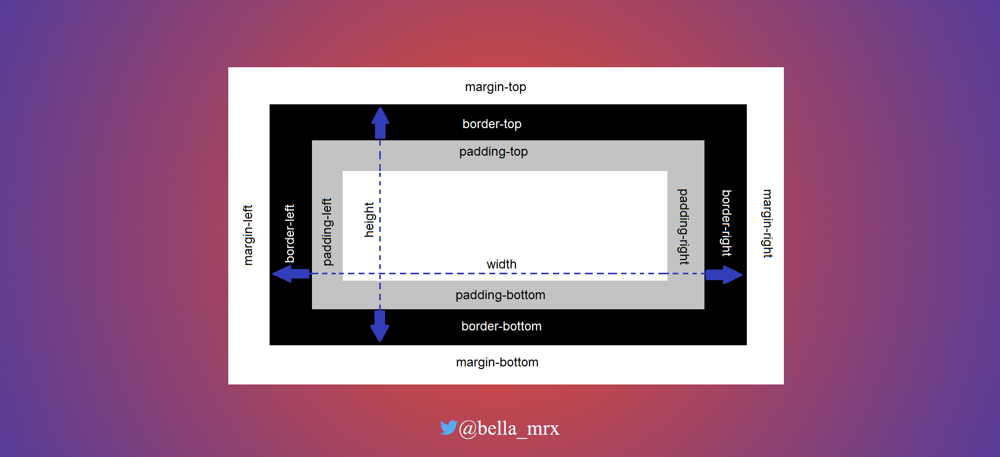


### Use box model `box-sizing`
To use the alternative box model, the CSS property `box-sizing` must be assigned the value `border-box` = `box-sizing: border-box`.

Values that can be used for `box-sizing`:
- `content-box`: This corresponds to the behavior of the classic box model, where the width and height values correspond to the content of the element in the box.
- `border-box`: With this specification the value for width and height corresponds to the value of border-left to border-right or border-top to border-bottom. Changing padding and border does not change the width or height of the element. 
- `inherit`: With this option the value of the parent element is inherited.


Classic box model:

 [Complete Code](https://github.com/BellaMrx/CSS_Guide_Part_2/blob/main/4_Box_Model/Part_8) --> *4_Box_Model/Part_8/index.html*
   ```
    <header class="headfoot">Header</header>
    <article class="article01">
        <h2>Article 1</h2>
        <p>
            Lorem <abbr>ipsum</abbr> dolor <em>sit amet</em>, consectetuer adipiscing elit. <strong>Aenean commodo</strong> ligula eget dolor.
            <a href="#">Aenean massa</a>. Cum sociis natoque penatibus et
            <ins>magnis</ins> dis parturient montes, nascetur
            <del>ridiculus</del> mus. Donec quam felis, <mark>ultricies nec</mark>, pellentesque eu, pretium quis, sem. Nulla consequat massa quis enim.
        </p>
    </article>
    <article class="article01">
        <h2>Article 2</h2>
        <p>
            Lorem <abbr>ipsum</abbr> dolor <em>sit amet</em>, consectetuer adipiscing elit. <strong>Aenean commodo</strong> ligula eget dolor.
            <a href="#">Aenean massa</a>. Cum sociis natoque penatibus et
            <ins>magnis</ins> dis parturient montes, nascetur
            <del>ridiculus</del> mus. Donec quam felis, <mark>ultricies nec</mark>, pellentesque eu, pretium quis, sem. Nulla consequat massa quis enim.
        </p>
    </article>
    <footer class="headfoot">Footer</footer>
   ```


 [Complete Code](https://github.com/BellaMrx/CSS_Guide_Part_2/blob/main/4_Box_Model/Part_8) --> *4_Box_Model/Part_8/styles/style.css*
   ```
    .headfoot {
        width: 70%;
        padding: 5px;
        border: 2px solid black;
        background-color: #adfd93;
        text-align: center;
    }

    .article01 {
        width: 70%;
        padding: 15px;
        border: 1px dotted #76ea4f;
        background-color: #e7fad7;
    }
   ```

 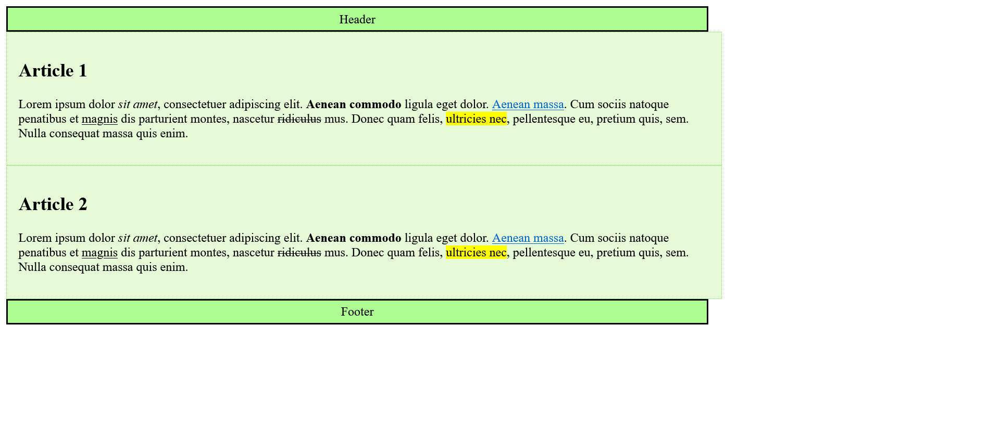


alternative Box model:

 [Complete Code](https://github.com/BellaMrx/CSS_Guide_Part_2/blob/main/4_Box_Model/Part_9) --> *4_Box_Model/Part_9/index.html*
   ```
    <header class="headfoot">Header</header>
      <article class="article01">
        <h1>Article 1</h1>
        <p>Lorem <abbr>ipsum</abbr> dolor <em>sit amet</em>, consectetuer adipiscing elit. <strong>Aenean commodo</strong> ligula eget dolor. <a href="#">Aenean massa</a>. Cum sociis natoque penatibus et <ins>magnis</ins> dis parturient montes, nascetur <del>ridiculus</del> mus. Donec quam felis, <mark>ultricies nec</mark>, pellentesque eu, pretium quis, sem. Nulla consequat massa quis enim.</p>
      </article>
      <article class="article01">
        <h1>Article 2</h1>
        <p>Lorem <abbr>ipsum</abbr> dolor <em>sit amet</em>, consectetuer adipiscing elit. <strong>Aenean commodo</strong> ligula eget dolor. <a href="#">Aenean massa</a>. Cum sociis natoque penatibus et <ins>magnis</ins> dis parturient montes, nascetur <del>ridiculus</del> mus. Donec quam felis, <mark>ultricies nec</mark>, pellentesque eu, pretium quis, sem. Nulla consequat massa quis enim.</p>
      </article>
    <footer class="headfoot">Footer</footer>
   ```


 [Complete Code](https://github.com/BellaMrx/CSS_Guide_Part_2/blob/main/4_Box_Model/Part_9) --> *4_Box_Model/Part_9/styles/style.css*
   ```
    * {
        box-sizing: border-box;        
    }

    .headfoot {
        width: 70%;
        padding: 5px;
        border: 2px solid black;
        background-color: #adfd93;
        text-align: center;
    }

    .article01 {
        width: 70%;
        padding: 15px;
        border: 1px dotted #76ea4f;
        background-color: #e7fad7;
    }
   ```

 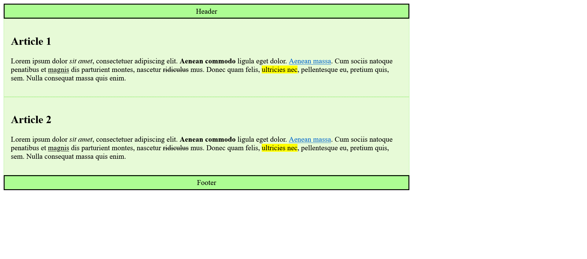


The box model with box-sizing can simplify CSS life considerably. Especially if percentages are used for the width and pixel values for padding or border, i.e. different units are mixed. For example, if a column is defined with 30% width, it is with `box-sizing: border-box;` no matter what values and units are used for padding or border, it remains at 30% for the total width of the column.

The interactive box model diagram, can be helpful to understand it better: [angular interactive box-model diagram](https://codepen.io/carolineartz/full/ogVXZj).

#### Analyzing the box model in the browser

The browsers also offer developer tools to analyze and visualize the box model in the browser. There it is also possible to change the values for testing and see how it directly affects the web page.

 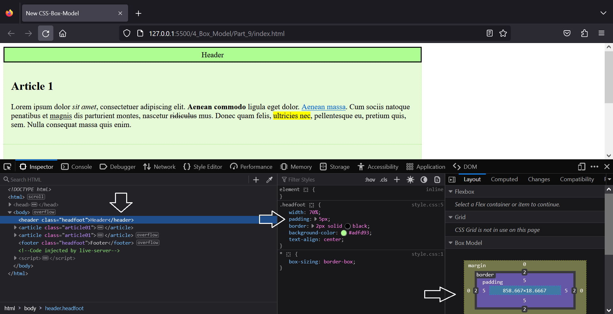


### The box model for inline elements
In HTML, everything consists of rectangular boxes. This also applies to inline elements like `<em>`, `<strong>` and `<a>`. However, it is not possible to specify the height or width for inline elements. Here the content determines the height and width. There are also differences in margin, padding and border for the -top and -bottom versions, these have no effect.


## 4.3. Design boxes
### Add and style a border with the `border` property 
A border can be added for each element, customizing the border color, stroke width and type.

With the shorthand, all four sides can be designed at once:

   ```
    border: 2px solid black;
   ```
this means: 

   ```
    border-color: black;
    border-width: 2px;
    border-style: solid;
   ```

It is possible to specify two, three or four values for border-style or border-color. For example, if :
   ```
    border-color: green red;
   ```

This means that the upper and lower frames are displayed in green and the right and left frames are displayed in red.

or:
   ```
    border-color: green red blue yellow;
   ```

This means the upper frame is green, the left one is red, the lower one is blue and the right one is yellow, (always in clockwise direction starting from the top).

With the properties border-top, border-left, border-bottom and border-right, all four sides can be designed individually.

   ```
    border-top: green 2px dotted;
    border-left: red 4px dashed;
    border-bottom: blue 6px solid;
    border-right: yellow 8px inset;
   ```

or only ones:

   ```
    border-top: green 2px dotted;
   ```
This means that only the upper border is displayed.

Different border styles 
| Value    | Description                         |
| -------- | ----------------------------------- |
| none 	   | Default value. Specifies no border. |
| hidden   | The same as "none", except in border conflict resolution for table elements. |
| dotted   | Specifies a dotted border. |
| dashed   | Specifies a dashed border. |
| solid    | Specifies a solid border. |
| double   | Specifies a double border. |
| groove   | Specifies a 3D grooved border. The effect depends on the border-color value. |
| ridge    | Specifies a 3D ridged border. The effect depends on the border-color value. |
| inset    | Specifies a 3D inset border. The effect depends on the border-color value. |
| outset   | Specifies a 3D outset border. The effect depends on the border-color value. |
| initial  | Sets this property to its default value. |
| inherit  | Inherits this property from its parent element. |

 [Complete Code](https://github.com/BellaMrx/CSS_Guide_Part_2/blob/main/4_Box_Model/Part_10) --> *4_Box_Model/Part_10/index.html*
   ```
    <body>
        <h1>Different types of border</h1>
        <p class="border01">border: blue 2px solid;</p>
        <p class="border02">
            border: red 1px dashed;<br /> border-left-width: 10px;
        </p>
        <p class="border03">border: green 5px ridge;</p>
        <p class="border04">
            border-top: red 5px dotted;<br /> border-right: blue 5px groove;<br /> border-bottom-style: double;<br /> border-bottom-width: 5px;<br /> border-bottom-color: green;<br /> border-left: orange 5px outset;
        </p>
    </body>
   ```


 [Complete Code](https://github.com/BellaMrx/CSS_Guide_Part_2/blob/main/4_Box_Model/Part_10) --> *4_Box_Model/Part_10/styles/style.css*
   ```
    * { 
        box-sizing: border-box;
    }

    .border01 {
        border: blue 2px solid;
    }

    .border02 {
        border: red 1px dashed;
        border-left-width: 20px;
    }

    .border03 {
        border: green 5px ridge;
    }

    .border04 {
        border-top: red 5px dotted;
        border-right: blue 5px groove;
        border-bottom-style: double;
        border-bottom-width: 5px;
        border-bottom-color: green;
        border-left: orange 5px outset;
    }
   ```

 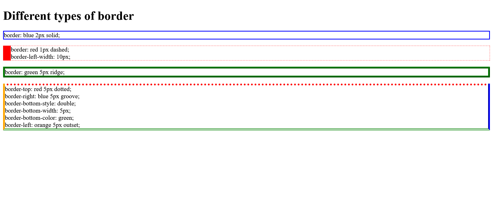


### Create a decorative border with `border-image`
With border-image a graphic can be used as a border. A pixel graphic or an SVG graphic is used for this purpose.

 [Complete Code](https://github.com/BellaMrx/CSS_Guide_Part_2/blob/main/4_Box_Model/Part_11) --> *4_Box_Model/Part_11/index.html*
   ```
    <body>
        <h1>Decorative border for boxes</h1>
        <p class="border">
            <code>.border {<br />
            &nbsp;width: 500px;<br />
            &nbsp;padding: 10px;<br />
            &nbsp;border: 25px solid transparent;<br />
            &nbsp;border-image:url('../images/myborder.png') 50 50 50 50 round;<br />
            }</code>
        </p>
    </body>
   ```


 [Complete Code](https://github.com/BellaMrx/CSS_Guide_Part_2/blob/main/4_Box_Model/Part_11) --> *4_Box_Model/Part_11/styles/style.css*
   ```
    .border {
        width: 500px;
        padding: 10px;
        border: 25px solid transparent;
        border-image: url("../images/myborder.png") 50 50 50 50 round;
    }
   ```

 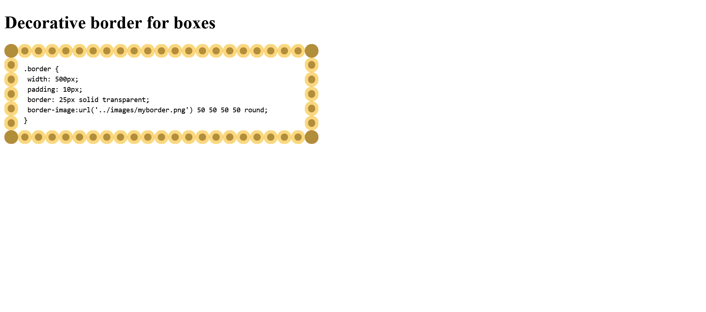

`border-image` is a summary property of `border-image-source`, `border-image-slice`, `border-image-width` and `border-image-repeat`.


### Set background color with `background-color`
The background color is specified with `background-color`. Only with `background` it is also possible but this is only a summary of CSS properties, so the shorthand.

 [Complete Code](https://github.com/BellaMrx/CSS_Guide_Part_2/blob/main/4_Box_Model/Part_12) --> *4_Box_Model/Part_12/index.html*
   ```
    <h1>Background color of boxes</h1>
    <p class="border">
        <code>.border {<br />
        &nbsp;background-color: lightblue;<br />
        &nbsp;width: 85%;<br />
        &nbsp;padding: 5px;<br />
        &nbsp;border: darkblue 7px ridge;<br />
      }</code>
    </p>
   ```


 [Complete Code](https://github.com/BellaMrx/CSS_Guide_Part_2/blob/main/4_Box_Model/Part_12) --> *4_Box_Model/Part_12/styles/style.css*
   ```
    .border {
        background-color: lightgreen;
        width: 85%;
        padding: 5px;
        border: darkgreen 7px ridge;
    }
   ```

 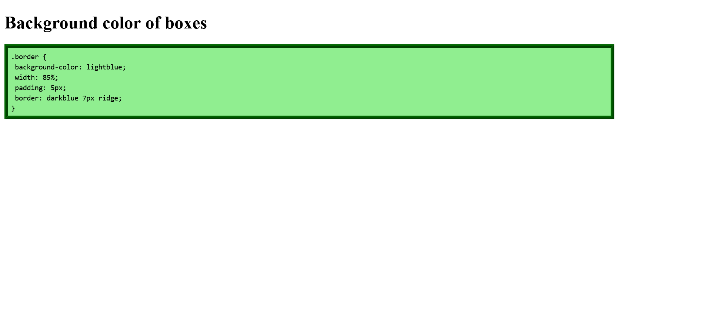


### Use background graphics
Since background is only a shorthand notation of several CSS properties for the background, the following properties are combined with the shorthand notation:
- `background-color`: background color of the element
- `background-image`: image as background of the element
- `background-position`: position of the background image
- `background-repeat`: repeat background image along the vertical or horizontal axis
- `background-attachment`: Here you can specify whether the background is scrollable or fixed.

Images, logos or graphics should still be added with the HTML element ``. But for decoration or design a background graphic can be added with CSS.

A background graphic can be added with the shorthand `background` or with `background-image`.

 [Complete Code](https://github.com/BellaMrx/CSS_Guide_Part_2/blob/main/4_Box_Model/Part_13) --> *4_Box_Model/Part_13/index.html*
   ```
    <header class="headfoot">Header</header>
    <article class="article01">
        <h1>Add background pattern</h1>
        <p>
            <code>.article01 {<br />
          &nbsp;width: 85%;<br />
          &nbsp;background-image: url('../images/pattern.png');<br />
          &nbsp;border-left: grey 1px dotted;<br />
          &nbsp;border-right: grey 1px dotted;<br />
          &nbsp;padding: 10px;<br />
          &nbsp;background-color: #c4c4c4;<br />
          }</code>
      </p>
    </article>
    <footer class="headfoot">Footer</footer>
   ```


 [Complete Code](https://github.com/BellaMrx/CSS_Guide_Part_2/blob/main/4_Box_Model/Part_13) --> *4_Box_Model/Part_13/styles/style.css*
   ```
    .headfoot {
        width: 85%;
        border: gray 1px dotted;
        padding: 10px;
        background-color: limegreen;
        color: white;
        text-align: center;
    }

    .article01 {
        width: 85%;
        background-image: url("../images/pattern.png");
        border-left: gray 1px dotted;
        border-right: gray 1px dotted;
        padding: 10px;
        background-color: #c4c4c4;
    }
   ```

 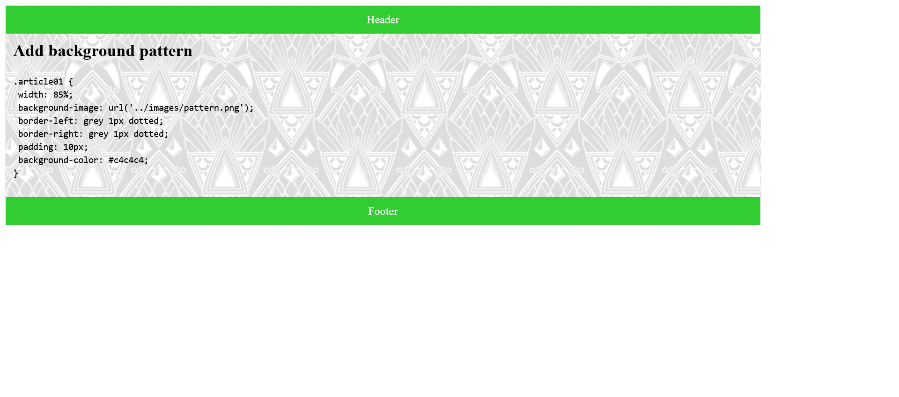

As you can see in this example, the background graphic is overlaid on the background color. The additional specification of a background color is useful (should match the color of the background graphic), if the graphic cannot be loaded.

You can also find the background patterns at [DinPattern](https://dinpattern.com/).


### Repeat background graphic
The background graphic is repeated vertically and horizontally as many times as space is available if no special specifications are made.

This example shows a background image without background-repeat, to the bottom it works fine but to the right it doesn't look optimal.

   ```
    .article01 {
        width: 85%;
        background-image: url("../images/gradient.jpg");

        border-left: gray 1px dotted;
        border-right: gray 1px dotted;
        padding: 10px;
        background-color: #e8f3ea;
    }
   ```

 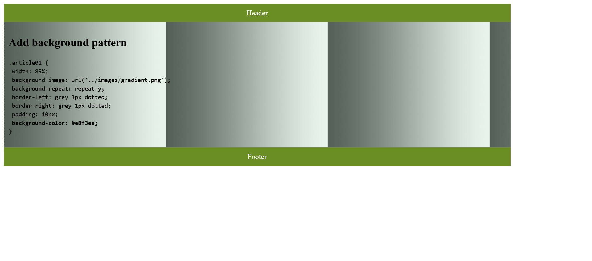

Tiling of the background image can be restricted to the vertical direction by `background-repeat`, it would also work without but only if the graphic has the appropriate dimensions. For tiling in vertical direction the CSS property `background-repeat` must be assigned the value `repeat-y`.

 [Complete Code](https://github.com/BellaMrx/CSS_Guide_Part_2/blob/main/4_Box_Model/Part_14) --> *4_Box_Model/Part_14/index.html*
   ```
    <header class="headfoot">Header</header>
    <article class="article01">
        <h1>Add background pattern</h1>
        <p>
            <code>.article01 {<br />
          &nbsp;width: 85%;<br />
          &nbsp;background-image: url('../images/gradient.png');<br />
          &nbsp;<b>background-repeat: repeat-y;</b><br />
          &nbsp;border-left: grey 1px dotted;<br />
          &nbsp;border-right: grey 1px dotted;<br />
          &nbsp;padding: 10px;<br />
          &nbsp;<b>background-color: #e8f3ea;</b><br />
          }</code>
      </p>
    </article>
    <footer class="headfoot">Footer</footer>
   ```


 [Complete Code](https://github.com/BellaMrx/CSS_Guide_Part_2/blob/main/4_Box_Model/Part_14) --> *4_Box_Model/Part_14/styles/style.css*
   ```
    .headfoot {
        width: 85%;
        border: gray 1px dotted;
        padding: 10px;
        background-color: limegreen;
        color: white;
        text-align: center;
    }

    .article01 {
        width: 85%;
        background-image: url("../images/pattern.png");
        background-repeat: repeat-y;
        border-left: gray 1px dotted;
        border-right: gray 1px dotted;
        padding: 10px;
        background-color: #c4c4c4;
    }
   ```

 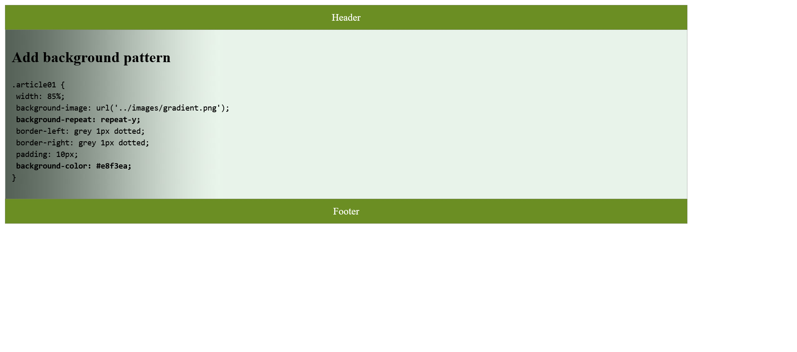

In total, there are three ways to tile a background graphic with the CSS background-repeat property:
- `background-repeat: repeat-y;` --> vertical tiling (y-axis)
- `background-repeat: repeat-x;` --> horizontal tiling (x-axis)
- `background-repeat: no-repeat;` --> no tiles at all 


### Position and fix background graphic
The `background-position` CSS property is used to position the background graphic in the HTML element. `top`, `right`, `bottom`, `left` or `center` can be used as positions.

 [Complete Code](https://github.com/BellaMrx/CSS_Guide_Part_2/blob/main/4_Box_Model/Part_15) --> *4_Box_Model/Part_15/index.html*
   ```
    <header class="headfoot">Header</header>
      <article class="article01">
        <h1>Add background pattern</h1>
        <p><code>.article01 {<br>
        &nbsp;width: 85%;<br>
        &nbsp;background-image: url('../images/pattern.png');<br>
        &nbsp;background-repeat: repeat-y;<br>
        &nbsp;<b>background-position: right top;</b><br>
        &nbsp;border-left: grey 1px dotted;<br>
        &nbsp;border-right: grey 1px dotted;<br>
        &nbsp;padding: 10px;<br>
        &nbsp;background-color: #e8f3ea;<br>
      }</code>
    </p>
      </article>
    <footer class="headfoot">Footer</footer>
   ```


 [Complete Code](https://github.com/BellaMrx/CSS_Guide_Part_2/blob/main/4_Box_Model/Part_15) --> *4_Box_Model/Part_15/styles/style.css*
   ```
    .article01 {
        width: 85%;
        background-image: url('../images/pattern.png');
        background-repeat: repeat-y;
        background-position: right top;
        border-left: gray 1px dotted;
        border-right: gray 1px dotted;
        padding: 10px;
        background-color: #e8f3ea;
    }
   ```

 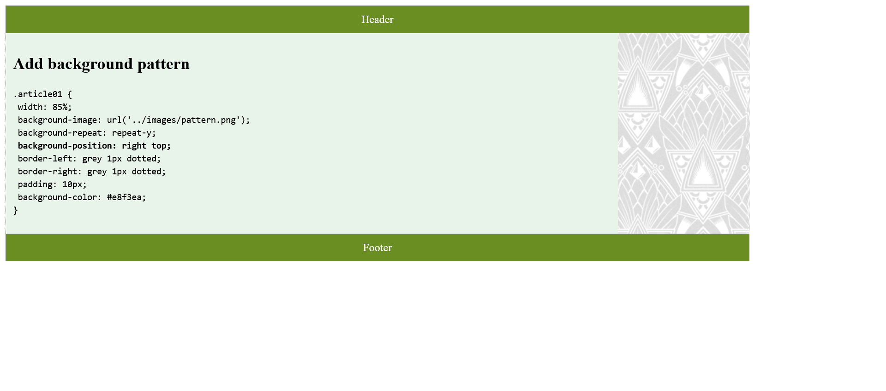


The CSS property `background-attachment` is used to fix a background graphic on the display area. When scrolling, the graphic remains inside the HTML element, this property is rarely used. The default value is `scroll`, which scrolls the background graphic along with the element as usual.

 [Complete Code](https://github.com/BellaMrx/CSS_Guide_Part_2/blob/main/4_Box_Model/Part_16) --> *4_Box_Model/Part_16/index.html*
   ```
    <header class="headfoot">Header</header>
      <article class="article01">
        <h1>Add background pattern</h1>
        <p><code>.article01 {<br>
        &nbsp;width: 85%;<br>
		&nbsp;height: 1800px;<br>
        &nbsp;background-image: url('../images/pattern.png');<br>
        &nbsp;<b>background-attachment: fixed;</b><br>
        &nbsp;border-left: grey 1px dotted;<br>
        &nbsp;border-right: grey 1px dotted;<br>
        &nbsp;padding: 10px;<br>
        &nbsp;background-color: #e8f3ea;<br>
      }</code>
    </p>
      </article>
    <footer class="headfoot">Footer</footer>
   ```


 [Complete Code](https://github.com/BellaMrx/CSS_Guide_Part_2/blob/main/4_Box_Model/Part_16) --> *4_Box_Model/Part_16/styles/style.css*
   ```
    .article01 {
        width: 85%;
        height: 1800px;
        background-image: url('../images/pattern.png');
        background-attachment: fixed;
        border-left: gray 1px dotted;
        border-right: gray 1px dotted;
        padding: 10px;
        background-color: #e8f3ea;
    }
   ```


### Stack multiple background graphics
Stacking multiple background images can be implemented in CSS as follows:

 [Complete Code](https://github.com/BellaMrx/CSS_Guide_Part_2/blob/main/4_Box_Model/Part_17) --> *4_Box_Model/Part_17/index.html*
   ```
    <header class="headfoot">Header</header>
    <article class="article01">
        <h1>Stack background images</h1>
        <p>
            New with CSS3 and already supported by all current browsers is the stacking of multiple background images. In this example, this was used to add an ornament to all four corners of the article element.
        </p>
    </article>
    <footer class="headfoot">Footer</footer>
   ```


 [Complete Code](https://github.com/BellaMrx/CSS_Guide_Part_2/blob/main/4_Box_Model/Part_17) --> *4_Box_Model/Part_17/styles/style.css*
   ```
    .article01 {
        width: 750px;
        padding: 20px 50px;
        margin: 10px 0px;
        background: url('../images/top-left.jpg') top left no-repeat,
                    url('../images/top-right.jpg') top right no-repeat,
                    url('../images/bottom-right.jpg') bottom right no-repeat,
                    url('../images/bottom-left.jpg') bottom left no-repeat,
                    white;
    }
   ```

 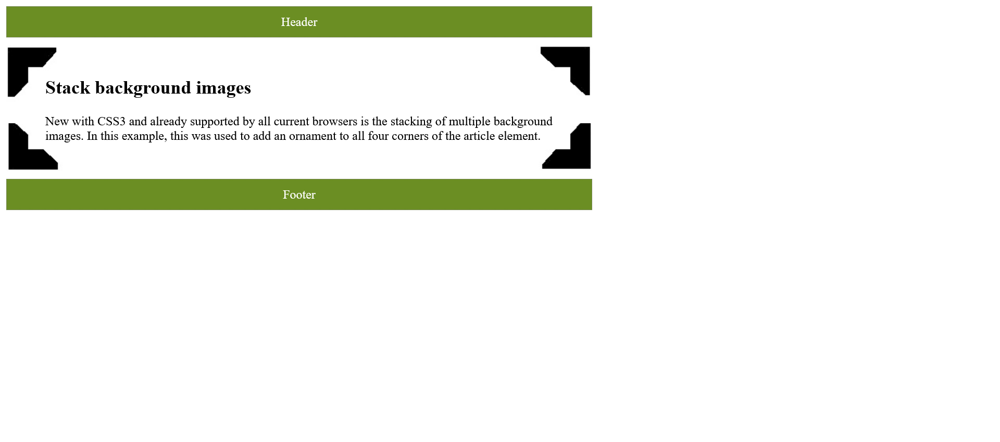


### Set the size of the background image
The CSS property `background-size` can be used to specify the size of the background graphic. The specification can be made in pixels or percent. A specification in percent is relative to the height and width of the parent element in which the background image is to be displayed.

 [Complete Code](https://github.com/BellaMrx/CSS_Guide_Part_2/blob/main/4_Box_Model/Part_18) --> *4_Box_Model/Part_18/index.html*
   ```
    <header class="headfoot">Header</header>
    <article class="article01">
        <h1>background-size</h1>
        <pre>.article01 {
                width: 750px;
                padding: 20px 50px;
                background: white url('../images/pattern.png') left no-repeat;
                <b>background-size: 100% 100%;</b>
       }</pre>
    </article>
    <footer class="headfoot">Footer</footer>
   ```


 [Complete Code](https://github.com/BellaMrx/CSS_Guide_Part_2/blob/main/4_Box_Model/Part_18) --> *4_Box_Model/Part_18/styles/style.css*
   ```
    .headfoot {
        width: 750px;
        border: gray 1px dotted;
        padding: 10px;
        background-color: olivedrab;
        color: white;
        text-align: center;
    }

    .article01 {
        width: 750px;
        padding: 20px 50px;
        background: white url("../images/pattern.png") left no-repeat;
        background-size: 100% 100%;
    }
   ```

 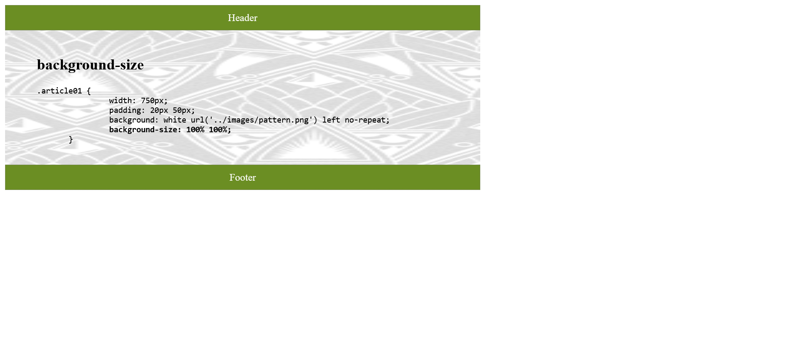

That scaling up or stretching pixel graphics is not necessarily optimal, because of the display. There are two more options `contain` and `cover` which can be used for `background-size`.
- `background-size: contain;` --> This will always display the background image completely in the box. So even if it does not fill the whole area.
- `background-size: cover;` --> This will always cover the entire area of the box with the image. Even if the image is not completely visible.

Viewing the box model in the third dimension --> [3D CSS Box Model](https://hicks.design/journal/3d-css-box-model)


### Make the boxes transparent
There are three ways to create transparent boxes. Either with *opacity* or RGBA or HSLA colors, as already described in the previous section. The difference between *opacity* and the RGBA or HSLA colors is that with opacity the transparency applies to all elements within the box.

 [Complete Code](https://github.com/BellaMrx/CSS_Guide_Part_2/blob/main/4_Box_Model/Part_19) --> *4_Box_Model/Part_19/index.html*
   ```
    <header class="headfoot">Header</header>
    <article class="article01">
        <h1>background-size</h1>
        <pre>.article01 {
                width: 750px;
                padding: 20px 50px;
                background: white url('../images/pattern.png') left no-repeat;
                <b>background-size: 100% 100%;</b>
       }</pre>
    </article>
    <footer class="headfoot">Footer</footer>
   ```


 [Complete Code](https://github.com/BellaMrx/CSS_Guide_Part_2/blob/main/4_Box_Model/Part_19) --> *4_Box_Model/Part_19/styles/style.css*
   ```
    .article_01 {
        width: 90%;
        padding: 10px;
        background-color: white;
        border: black 1px dotted;
        opacity: 0.5;
    }

    .article_02 {
        width: 90%;
        padding: 10px;
        background-color: white;
        border: black 1px dotted;
        background-color: rgba(255, 255, 255, 0.5);
    }
   ```

 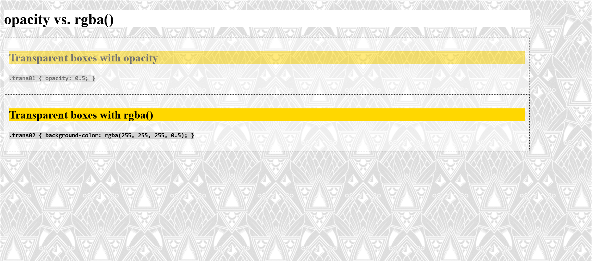

The CSS property *opacity* is more useful for graphics and images, because there the transparency does not work with RGBA or HSLA colors. For boxes with text, RGBA or HSLA colors should be used.

### Add a color gradient
A linear gradient is created with the CSS function `linear-gradient()` and assigned to the `background` (or `background-image`) property.
   ```
    background: linear-gradient(white, orange);
   ```
- This displays a linear color gradient from white to orange and from top to bottom (default setting).

To direct the gradient in a different direction, the keyword `to` , followed by the direction `bottom` (top to bottom), `top` (bottom to top), `right` (left to right) or `left` (right to left) must be specified.
   ```
    background: linear-gradient(to right, white, orange);
   ```
- This displays a linear gradient from white to orange, but this time with a gradient from left to right.

It is also possible to specify the position of the color break.
   ```
    background: linear-gradient(to right, white 0%, orange 100%);
   ```

It is also possible to repeat a gradient:
   ```
    background: repeating-linear-gradient(40deg, white, white 25px, orange 25px, orange 50px); 
   ```

Diagonal directions can be displayed with `to right bottom` (top left to bottom right) and `to left top` (bottom right to top left).

 [Complete Code](https://github.com/BellaMrx/CSS_Guide_Part_2/blob/main/4_Box_Model/Part_20) --> *4_Box_Model/Part_20/index.html*
   ```
    <header class="headfoot">Linear color gradients (start)</header>
    <article class="trans01 my_article">
        <p><code>background: linear-gradient(white, orange);</code></p>
    </article>
    <article class="trans02 my_article">
        <p><code>background: linear-gradient(to right, white, orange);</code></p>
    </article>
    <article class="trans03 my_article">
        <p>
            <code>background: linear-gradient(to right, white 30%, orange 70%);</code
        >
      </p>
    </article>
    <article class="trans04 my_article">
      <p>
        <code
          >background: linear-gradient(to right, white 50%, orange 50%);</code
        >
      </p>
    </article>
    <article class="trans05 my_article">
      <p>
        <code
          >&nbsp;background: linear-gradient(to left, white 50%, orange 50%);<br />
          &nbsp;background-size: 50px 100px;</code
        >
      </p>
    </article>
    <article class="trans06 my_article">
      <p>
        <code
          >background: repeating-linear-gradient(40deg, white, white 25px,
          orange 25px, orange 50px);</code
        >
      </p>
    </article>
    <footer class="headfoot">Linear color gradients (end)</footer>
   ```


 [Complete Code](https://github.com/BellaMrx/CSS_Guide_Part_2/blob/main/4_Box_Model/Part_20) --> *4_Box_Model/Part_20/styles/style.css*
   ```
    .trans01 { 
        background: linear-gradient(white, orange); 
    }

    .trans02 { 
        background: linear-gradient(to right, white, orange);  
    }

    .trans03 { 
        background: linear-gradient(to right, white 30%, orange 70%);  
    }

    .trans04 { 
        background: linear-gradient(to right, white 50%, orange 50%);  
    }

    .trans05 {
        background: linear-gradient(to left, white 50%, orange 50%);
        background-size: 50px 100px;
    }

    .trans06 { 
        background: repeating-linear-gradient(40deg, white, white 25px, orange 25px, orange 50px);     
    }
   ```

 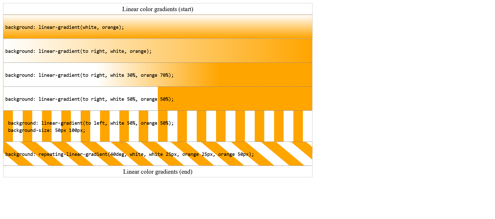


In addition to the linear color gradients, there are also the radial color gradients, these are displayed with `radial-gradient()`.

 [Complete Code](https://github.com/BellaMrx/CSS_Guide_Part_2/blob/main/4_Box_Model/Part_21) --> *4_Box_Model/Part_21/index.html*
   ```
    <header class="headfoot">Radial color gradients (start)</header>
      <article class="trans01 my_article">
        <p><code>background: radial-gradient(white, orange);</code></p>
      </article>
      <article class="trans02 my_article">
        <p><code>background: radial-gradient( white 30%, orange 70%);</code></p>
      </article>
      <article class="trans03 my_article">
        <p><code>background: repeating-radial-gradient(white, white 10px, orange 10px, orange 20px);</code></p>
      </article>
      <article class="trans04 my_article">
        <p><code>background: repeating-radial-gradient(circle, white, white 10px, orange 10px, orange 20px);</code></p>
      </article>
    <footer class="headfoot">Radial color gradients (end)</footer>
   ```


 [Complete Code](https://github.com/BellaMrx/CSS_Guide_Part_2/blob/main/4_Box_Model/Part_21) --> *4_Box_Model/Part_21/styles/style.css*
   ```
    .trans01 { 
        background: radial-gradient(white, orange); 
    }

    .trans02 { 
        background: radial-gradient( white 30%, orange 70%);  
    }

    .trans03 { 
        background: repeating-radial-gradient(white, white 10px, orange 10px, orange 20px);  
    }

    .trans04 { 
        background: repeating-radial-gradient(circle, white, white 10px, orange 10px, orange 20px); 
    }
   ```

 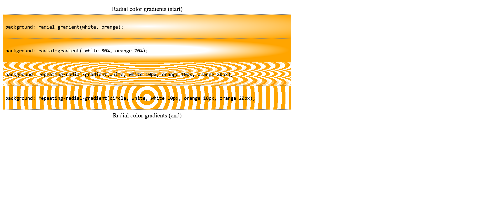


Multiple colors can also be used for the gradient:

 [Complete Code](https://github.com/BellaMrx/CSS_Guide_Part_2/blob/main/4_Box_Model/Part_22) --> *4_Box_Model/Part_22/index.html*
   ```
    <header class="headfoot">Multicolor color gradients (start)</header>
      <article class="trans01 my_article">
        <p><code>background: linear-gradient(to left, purple, blue, green, yellow, red, purple); </code></p>
      </article>
      <article class="trans02 my_article">
        <p><code>background: radial-gradient( purple, blue, green, yellow, red, purple); </code></p>
      </article>
    <footer class="headfoot">Multicolor color gradients (end)</footer>
   ```


 [Complete Code](https://github.com/BellaMrx/CSS_Guide_Part_2/blob/main/4_Box_Model/Part_22) --> *4_Box_Model/Part_22/styles/style.css*
   ```
    .trans01 { 
        background: linear-gradient(to left, purple, blue, green, yellow, red, purple);  
    }

    .trans02 { 
        background: radial-gradient( purple, blue, green, yellow, red, purple);  
    }
   ```

 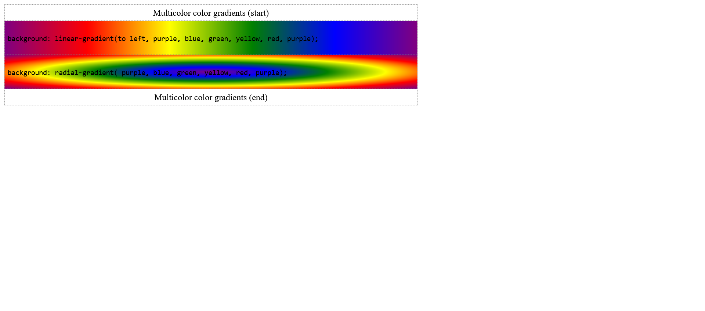

Create gradients with online tools: [Ultimate CSS Gradient Generator](https://www.colorzilla.com/gradient-editor/)


### Add a drop shadow with the `box-shadow` property
With the CSS property `box-shadow` it is possible to create a shadow. The simplest specification is as follows:
   ```
    box-shadow: 4px 4px gray;
   ```
- This creates a shadow around the element, with a horizontal and vertical offset of 4 pixels each. The first value is used for the horizontal offset (offset-x) and the second value for the vertical offset (offset-y). A positive value moves the shadow of the horizontal offset to the right and the vertical offset down. The opposite happens with negative values.

For a soft shadow, a third value is needed to define the blurriness of the shadow. The higher the value, the softer the shadow (default value = 0).
   ```
    box-shadow: 4px 4px 4px gray;
   ```

To determine a radius or the spread of the shadow, a fourth value is needed. The last value defines the color of the shadow. This can also be a at the beginning.
   ```
    box-shadow: 4px 4px 4px 4px gray;
   ```

It is also possible to represent an inner shadow with `inset`.
   ```
    box-shadow: inset -4px -4px 4px 4px gray;
   ```


 [Complete Code](https://github.com/BellaMrx/CSS_Guide_Part_2/blob/main/4_Box_Model/Part_23) --> *4_Box_Model/Part_23/index.html*
   ```
    <h1>Add shadows</h1>
    <pre class="shadow01 my_pre">box-shadow: 4px 4px gray;</pre>
    <pre class="shadow02 my_pre">box-shadow: 4px 4px 4px gray;</pre>
    <pre class="shadow03 my_pre">box-shadow: 4px 4px 4px 4px gray;</pre>
    <pre class="shadow04 my_pre">box-shadow: inset -4px -4px 4px 4px gray;</pre>
    
   ```


 [Complete Code](https://github.com/BellaMrx/CSS_Guide_Part_2/blob/main/4_Box_Model/Part_23) --> *4_Box_Model/Part_23/styles/style.css*
   ```
    .shadow01 {  
        box-shadow:4px 4px gray;
    }

    .shadow02 {  
        box-shadow:4px 4px 4px gray;
    }

    .shadow03 {  
        box-shadow:4px 4px 4px 4px gray;
    }

    .shadow04 {  
        box-shadow:inset -4px -4px 4px 4px gray;
    }

    .my_img {
        border: black 2px solid;
        box-shadow: 6px 6px 6px gray;
    }
   ```

 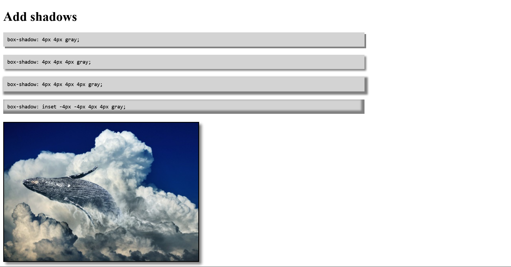


### Designing round corners
To create round corners the CSS property `border-radius` can be used. This property can be used independently from `border`. There is no need to use a frame to round the corners. 
   ```
    border-radius: 10px;
   ```

is the short form of:
   ```
    border-top-right-radius: 10px;
    border-top-left-radius: 10px;
    border-bottom-right-radius: 10px;
    border-bottom-left-radius: 10px;    
   ```

It is also possible to enter multiple values:
   ```
    border-radius: 20px 10px;
   ```

- Here the upper left corner and the lower right corner get a radius of 20 pixels and the upper right corner and the lower left corner get a radius of 10 pixels.


 [Complete Code](https://github.com/BellaMrx/CSS_Guide_Part_2/blob/main/4_Box_Model/Part_24) --> *4_Box_Model/Part_24/index.html*
   ```
    <header class="head">Header</header>
    <article class="article01">
        <h1>Round corners</h1>
        <p>
            Lorem ipsum dolor sit amet, consectetuer adipiscing elit. Aenean commodo ligula eget dolor. Aenean massa. Cum sociis natoque penatibus et magnis dis parturient montes, nascetur ridiculus mus.
        </p>
    </article>
    <footer class="foot">Footer</footer>
   ```


 [Complete Code](https://github.com/BellaMrx/CSS_Guide_Part_2/blob/main/4_Box_Model/Part_24) --> *4_Box_Model/Part_24/styles/style.css*
   ```
    .head {
        width: 85%;
        border: gray 1px solid;
        padding: 10px;
        background-color: white;
        text-align: center;
        border-top-left-radius: 10px;
        border-top-right-radius: 10px;
        box-shadow: 2px 2px 2px gray;
    }

    .article01 {
        width: 85%;
        padding: 20px 50px;
        margin: 10px 0px;
        border: gray 1px solid;
        border-radius: 20px;
        box-shadow: 2px 2px 2px gray;
    }

    .foot {
        width: 85%;
        border: gray 1px solid;
        padding: 10px;
        background-color: white;
        text-align: center;
        border-radius: 0px 0px 10px 10px;
        box-shadow: 2px 2px 2px gray;
    }
   ```

 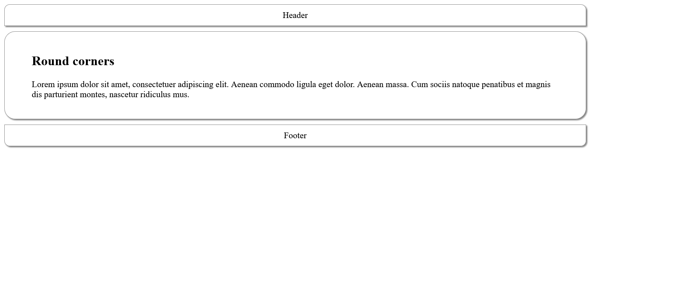


Round corners can also be used for images.

 [Complete Code](https://github.com/BellaMrx/CSS_Guide_Part_2/blob/main/4_Box_Model/Part_25) --> *4_Box_Model/Part_25/index.html*
   ```
    <h1>Round corners</h1>
    
    
   ```


 [Complete Code](https://github.com/BellaMrx/CSS_Guide_Part_2/blob/main/4_Box_Model/Part_25) --> *4_Box_Model/Part_25/styles/style.css*
   ```
    .img_radius {
        border-radius: 25px;
        box-shadow: 2px 2px 2px gray;
    }

    .img_ellipse {
        border-radius: 50%;
        box-shadow: 2px 2px 2px gray;
    }
   ```

 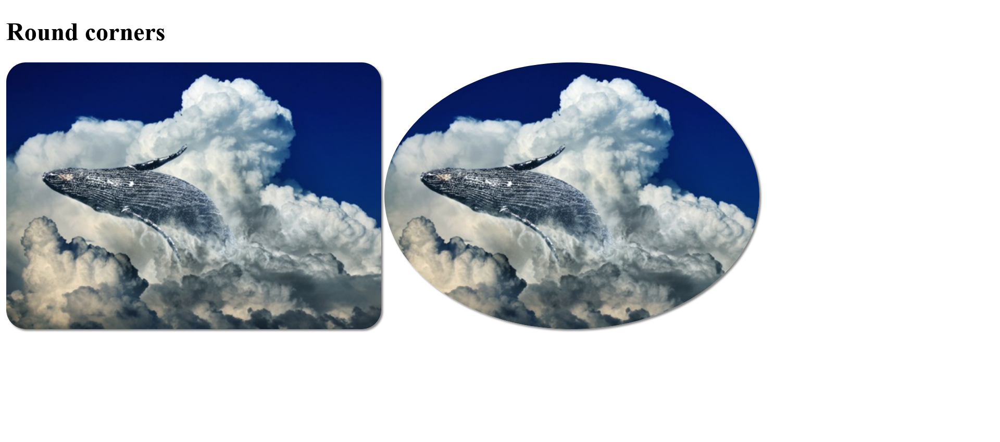


There is also the possibility to specify different values for the horizontal and vertical raduis. To do this, both values are separated with a `/`. The result is corners with elliptical corners with roundings.

 [Complete Code](https://github.com/BellaMrx/CSS_Guide_Part_2/blob/main/4_Box_Model/Part_26) --> *4_Box_Model/Part_26/index.html*
   ```
    <header class="head">
        border-radius: 10px 20px 30px 40px / 5px 10px 5px 10px;
    </header>
    <article class="article01">
        <h1>Elliptical roundings</h1>
        <p>
            Lorem ipsum dolor sit amet, consectetuer adipiscing elit. Aenean commodo ligula eget dolor. Aenean massa. Cum sociis natoque penatibus et magnis dis parturient montes, nascetur ridiculus mus.
        </p>
    </article>
    <footer class="foot">border-radius: 5px 10px / 20px;</footer>
   ```


 [Complete Code](https://github.com/BellaMrx/CSS_Guide_Part_2/blob/main/4_Box_Model/Part_26) --> *4_Box_Model/Part_26/styles/style.css*
   ```
    .head {
        width: 85%;
        border: gray 1px solid;
        padding: 10px;
        background-color: white;
        text-align: center;
        border-radius: 10px 20px 30px 40px / 5px 10px 5px 10px;
        box-shadow: 2px 2px 2px gray;
    }

    .article01 {
        width: 85%;
        padding: 20px 50px;
        margin: 10px 0px;
        border: gray 1px solid;
        border-radius: 80% / 20%;
        box-shadow: 2px 2px 2px gray;
    }

    .foot {
        width: 85%;
        border: gray 1px solid;
        padding: 10px;
        background-color: white;
        text-align: center;
        border-radius: 5px 10px / 20px;
        box-shadow: 2px 2px 2px gray;
    }
   ```

 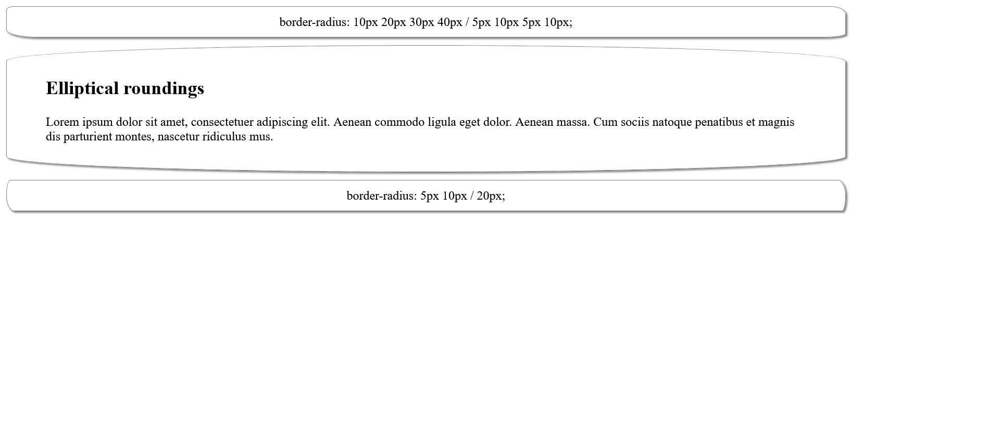


## 4.4. CSS Vendor Prefixes
Vendor prefix can be used to (experimentally) use CSS properties that are still in draft or beta state. When the corresponding CSS module is in the final version and the web browser fully supports the property, the prefix can be removed. However, it is recommended to keep it so that even older web browsers can display everything accurately.

Most common vendor prefixes:
| Abbreviation | Producer             |
| ------------ | ---------------------|
| -webkit-	   | Chrome, Safari, Edge |
| -moz-        | Mozilla Firefox      |
| -o-          | Opera                |

 [Complete Code](https://github.com/BellaMrx/CSS_Guide_Part_2/blob/main/4_Box_Model/Part_27) --> *4_Box_Model/Part_27/index.html*
   ```
    <header class="headfoot">Header</header>
    <article class="article01">
        <h1>Article 1</h1>
        <p>
            Lorem <abbr>ipsum</abbr> dolor <em>sit amet</em>, consectetuer adipiscing elit. <strong>Aenean commodo</strong> ligula eget dolor.
            <a href="#">Aenean massa</a>. Cum sociis natoque penatibus et
            <ins>magnis</ins> dis parturient montes, nascetur
            <del>ridiculus</del> mus. Donec quam felis, <mark>ultricies nec</mark>, pellentesque eu, pretium quis, sem. Nulla consequat massa quis enim.
        </p>
    </article>
    <article class="article01">
        <h1>Article 2</h1>
        <p>
            Lorem <abbr>ipsum</abbr> dolor <em>sit amet</em>, consectetuer adipiscing elit. <strong>Aenean commodo</strong> ligula eget dolor.
            <a href="#">Aenean massa</a>. Cum sociis natoque penatibus et
            <ins>magnis</ins> dis parturient montes, nascetur
            <del>ridiculus</del> mus. Donec quam felis, <mark>ultricies nec</mark>, pellentesque eu, pretium quis, sem. Nulla consequat massa quis enim.
        </p>
    </article>
    <footer class="headfoot">Footer</footer>
   ```


 [Complete Code](https://github.com/BellaMrx/CSS_Guide_Part_2/blob/main/4_Box_Model/Part_27) --> *4_Box_Model/Part_27/styles/style.css*
   ```
    h1 {
        -webkit-text-emphasis: filled double-circle green;
        -moz-text-emphasis: filled double-circle green;
        text-emphasis: filled double-circle green;
    }
   ```

 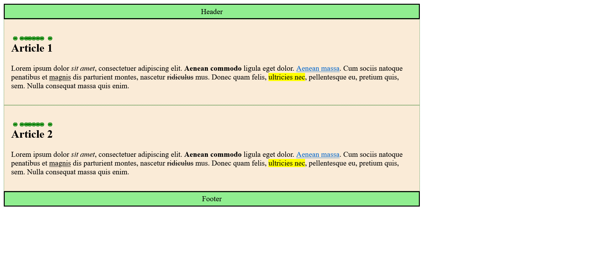

Each WebDev is responsible for compliance with the standard, which means that a browser-specific CSS property noted with a vendor prefix can be changed again or even deleted altogether.

A good overview, to the current versions can be found here [Can I use?](http://caniuse.com).

--------------------------------------------------------------------------------------------

# 5. CSS positioning
The HTML elements are usually displayed one after the other in the order in which they were noted in the HTML code. However, you are not limited to this static positioning and can be influenced with CSS.


## 5.1. Positioning with the CSS property `position`
How and where an element is positioned and what is to happen to the elements following it is determined with the `position` property. There are four possible methods for positioning elements:


### `position: static;` 
This is the default setting for all elements, and it is used when the CSS property `position` has not been noted at all. So the elements are displayed side by side as usual.

 [Complete Code](https://github.com/BellaMrx/CSS_Guide_Part_2/blob/main/5_CSS_Positioning/Part_1) --> *5_CSS_Positioning/Part_1/index.html*
   ```
    <header class="foothead">Header</header>
    <article class="article01">
        <h1>Article 1</h1>
        <p>Lorem ipsum dolor sit amet, consectetuer adipiscing elit. Aenean commodo ligula eget dolor. Aenean massa. </p>
    </article>
    <article class="article02">
        <h1>Article 2</h1>
        <p>Lorem ipsum dolor sit amet, consectetuer adipiscing elit. Aenean commodo ligula eget dolor. Aenean massa. </p>
    </article>
    <article>
        <p>Lorem ipsum dolor sit amet, consectetuer adipiscing elit. Aenean commodo ligula eget dolor. Aenean massa. Cum sociis natoque penatibus et magnis dis parturient montes, nascetur ridiculus mus. Donec quam felis, ultricies nec, pellentesque eu, pretium
            quis, sem. Nulla consequat massa quis enim. Donec pede justo, fringilla vel, aliquet nec, vulputate eget, arcu. In enim justo, rhoncus ut, imperdiet a, venenatis vitae, justo. Nullam dictum felis eu pede mollis pretium. Integer tincidunt.
            Cras dapibus. Vivamus elementum semper nisi. Aenean vulputate eleifend tellus. Aenean leo ligula, porttitor eu, consequat vitae, eleifend ac, enim. Aliquam lorem ante, dapibus in, viverra quis, feugiat a, tellus. Phasellus viverra nulla ut
            metus varius laoreet. Quisque rutrum. Aenean imperdiet. Etiam ultricies nisi vel augue. Curabitur ullamcorper ultricies nisi. Nam eget dui. Etiam rhoncus. Maecenas tempus, tellus eget. Lorem ipsum dolor sit amet, consectetuer adipiscing elit.
            Aenean commodo ligula eget dolor. Aenean massa. Cum sociis natoque penatibus et magnis dis parturient montes, nascetur ridiculus mus. Donec quam felis, ultricies nec, pellentesque eu, pretium quis, sem. Nulla consequat massa quis enim. Donec
            pede justo, fringilla vel, aliquet nec, vulputate eget, arcu. In enim justo, rhoncus ut, imperdiet a, venenatis vitae, justo. Nullam dictum felis eu pede mollis pretium. Integer tincidunt. Cras dapibus. Vivamus elementum semper nisi. Aenean
            vulputate eleifend tellus. Aenean leo ligula, porttitor eu, consequat vitae, eleifend ac, enim. Aliquam lorem ante, dapibus in, viverra quis, feugiat a, tellus. Phasellus viverra nulla ut metus varius laoreet. Quisque rutrum. Aenean imperdiet.
            Etiam ultricies nisi vel augue. Curabitur ullamcorper ultricies nisi. Nam eget dui. Etiam rhoncus. Maecenas tempus, tellus eget </p>
    </article>
    <footer class="foothead">Footer</footer>
   ```


 [Complete Code](https://github.com/BellaMrx/CSS_Guide_Part_2/blob/main/5_CSS_Positioning/Part_1) --> *5_CSS_Positioning/Part_1/styles/style.css*
   ```
    .article01 {
        position: static;
        width: 300px;
        padding: 10px;
        border: 1px solid black;
        background-color: #adfd93;
    }

    .article02 {
        position: static;
        width: 300px;
        padding: 10px;
        border: 1px solid black;
        background-color: #e7fad7;
    }
   ```

 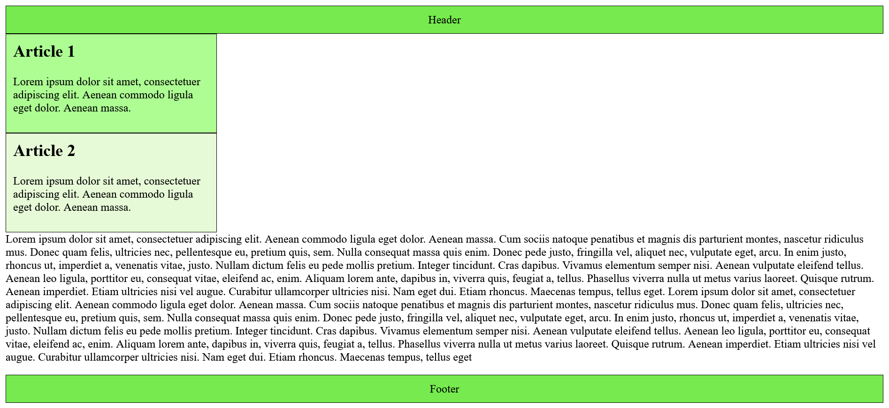


### `position: relative;`
This places an element relative to the current position with the CSS property `top`, `bottom`, `left` and `right` and the corresponding value specifications. The other elements are not affected.

 [Complete Code](https://github.com/BellaMrx/CSS_Guide_Part_2/blob/main/5_CSS_Positioning/Part_2l) --> *5_CSS_Positioning/Part_2/index.html*
   ```
    <header class="foothead">Header</header>
      <article class="article01">
        <h1>Article  1</h1>
        <p>Lorem ipsum dolor sit amet, consectetuer adipiscing elit. Aenean commodo ligula eget dolor. Aenean massa. </p>
      </article>
      <article class="article02">
        <h1>Article  2</h1>
        <p>Lorem ipsum dolor sit amet, consectetuer adipiscing elit. Aenean commodo ligula eget dolor. Aenean massa. </p>
      </article>
	  <article>
        <p>Lorem ipsum dolor sit amet, consectetuer adipiscing elit. Aenean commodo ligula eget dolor. Aenean massa. Cum sociis natoque penatibus et magnis dis parturient montes, nascetur ridiculus mus. Donec quam felis, ultricies nec, pellentesque eu, pretium quis, sem. Nulla consequat massa quis enim. Donec pede justo, fringilla vel, aliquet nec, vulputate eget, arcu. In enim justo, rhoncus ut, imperdiet a, venenatis vitae, justo. Nullam dictum felis eu pede mollis pretium. Integer tincidunt. Cras dapibus. Vivamus elementum semper nisi. Aenean vulputate eleifend tellus. Aenean leo ligula, porttitor eu, consequat vitae, eleifend ac, enim. Aliquam lorem ante, dapibus in, viverra quis, feugiat a, tellus. Phasellus viverra nulla ut metus varius laoreet. Quisque rutrum. Aenean imperdiet. Etiam ultricies nisi vel augue. Curabitur ullamcorper ultricies nisi. Nam eget dui. Etiam rhoncus. Maecenas tempus, tellus eget. Lorem ipsum dolor sit amet, consectetuer adipiscing elit. Aenean commodo ligula eget dolor. Aenean massa. Cum sociis natoque penatibus et magnis dis parturient montes, nascetur ridiculus mus. Donec quam felis, ultricies nec, pellentesque eu, pretium quis, sem. Nulla consequat massa quis enim. Donec pede justo, fringilla vel, aliquet nec, vulputate eget, arcu. In enim justo, rhoncus ut, imperdiet a, venenatis vitae, justo. Nullam dictum felis eu pede mollis pretium. Integer tincidunt. Cras dapibus. Vivamus elementum semper nisi. Aenean vulputate eleifend tellus. Aenean leo ligula, porttitor eu, consequat vitae, eleifend ac, enim. Aliquam lorem ante, dapibus in, viverra quis, feugiat a, tellus. Phasellus viverra nulla ut metus varius laoreet. Quisque rutrum. Aenean imperdiet. Etiam ultricies nisi vel augue. Curabitur ullamcorper ultricies nisi. Nam eget dui. Etiam rhoncus. Maecenas tempus, tellus eget </p>
      </article>   
   <footer class="foothead">Footer</footer>
   ```


 [Complete Code](https://github.com/BellaMrx/CSS_Guide_Part_2/blob/main/5_CSS_Positioning/Part_2) --> *5_CSS_Positioning/Part_2/styles/style.css*
   ```
    .article01 {
        position: static;
        width: 300px;
        padding: 10px;
        border: 1px solid black;
        background-color: #adfd93;
    }

    .article02 {
        position: relative;
        top: -75px;
        left: 100px;
        width: 300px;
        padding: 10px;
        border: 1px solid black;
        background-color: #e7fad7;
    }
   ```

 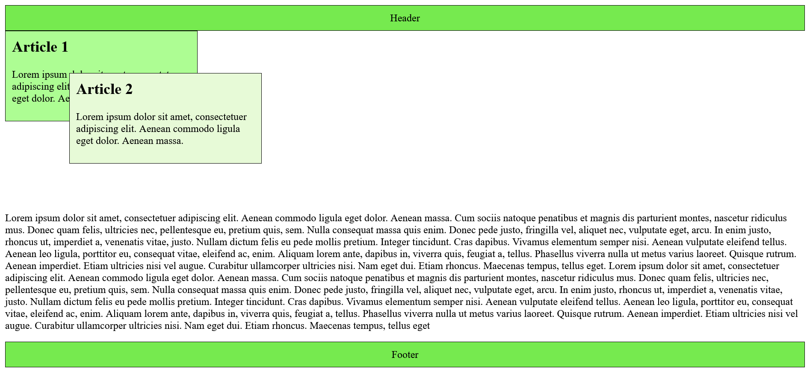


### `position: absolute;`  
This drags the element out of the document flow. With the CSS properties `top`, `bottom`, `left` and `right` the element can be placed absolutely in the nearest parent element. Regardless of where the element was noted in the HTML document. All other elements will now act as if the absolutely moved element no longer belongs to the document flow and any gap thus created will be filled with the following element.

 [Complete Code](https://github.com/BellaMrx/CSS_Guide_Part_2/blob/main/5_CSS_Positioning/Part_3) --> *5_CSS_Positioning/Part_3/index.html*
   ```
    <header class="foothead">Header</header>
      <article class="article01">
        <h1>Article 1</h1>
        <p>Lorem ipsum dolor sit amet, consectetuer adipiscing elit. Aenean commodo ligula eget dolor. Aenean massa. </p>
      </article>
      <article class="article02">
        <h1>Article 2</h1>
        <p>Lorem ipsum dolor sit amet, consectetuer adipiscing elit. Aenean commodo ligula eget dolor. Aenean massa. </p>
      </article>
      <p>Lorem ipsum dolor sit amet, consectetuer adipiscing elit. Aenean commodo ligula eget dolor. Aenean massa. Cum sociis natoque penatibus et magnis dis parturient montes, nascetur ridiculus mus. Donec quam felis, ultricies nec, pellentesque eu, pretium quis, sem. Nulla consequat massa quis enim. Donec pede justo, fringilla vel, aliquet nec, vulputate eget, arcu. In enim justo, rhoncus ut, imperdiet a, venenatis vitae, justo. Nullam dictum felis eu pede mollis pretium. Integer tincidunt. Cras dapibus. Vivamus elementum semper nisi. Aenean vulputate eleifend tellus. Aenean leo ligula, porttitor eu, consequat vitae, eleifend ac, enim. Aliquam lorem ante, dapibus in, viverra quis, feugiat a, tellus. Phasellus viverra nulla ut metus varius laoreet. Quisque rutrum. Aenean imperdiet. Etiam ultricies nisi vel augue. Curabitur ullamcorper ultricies nisi. Nam eget dui. Etiam rhoncus. Maecenas tempus, tellus eget. Lorem ipsum dolor sit amet, consectetuer adipiscing elit. Aenean commodo ligula eget dolor. Aenean massa. Cum sociis natoque penatibus et magnis dis parturient montes, nascetur ridiculus mus. Donec quam felis, ultricies nec, pellentesque eu, pretium quis, sem. Nulla consequat massa quis enim. Donec pede justo, fringilla vel, aliquet nec, vulputate eget, arcu. In enim justo, rhoncus ut, imperdiet a, venenatis vitae, justo. Nullam dictum felis eu pede mollis pretium. Integer tincidunt. Cras dapibus. Vivamus elementum semper nisi. Aenean vulputate eleifend tellus. Aenean leo ligula, porttitor eu, consequat vitae, eleifend ac, enim. Aliquam lorem ante, dapibus in, viverra quis, feugiat a, tellus. Phasellus viverra nulla ut metus varius laoreet. Quisque rutrum. Aenean imperdiet. Etiam ultricies nisi vel augue. Curabitur ullamcorper ultricies nisi. Nam eget dui. Etiam rhoncus. Maecenas tempus, tellus eget </p>
    <footer class="foothead">Footer</footer>
   ```


 [Complete Code](https://github.com/BellaMrx/CSS_Guide_Part_2/blob/main/5_CSS_Positioning/Part_3) --> *5_CSS_Positioning/Part_3/styles/style.css*
   ```
    .article01 {
        position: static;
        width: 300px;
        padding: 10px;
        border: 1px solid black;
        background-color: #adfd93;
    }

    .article02 {
        position: absolute;
        top: 0;
        left: 100px;
        width: 300px;
        padding: 10px;
        border: 1px solid black;
        background-color: #e7fad7;
    }
   ```

 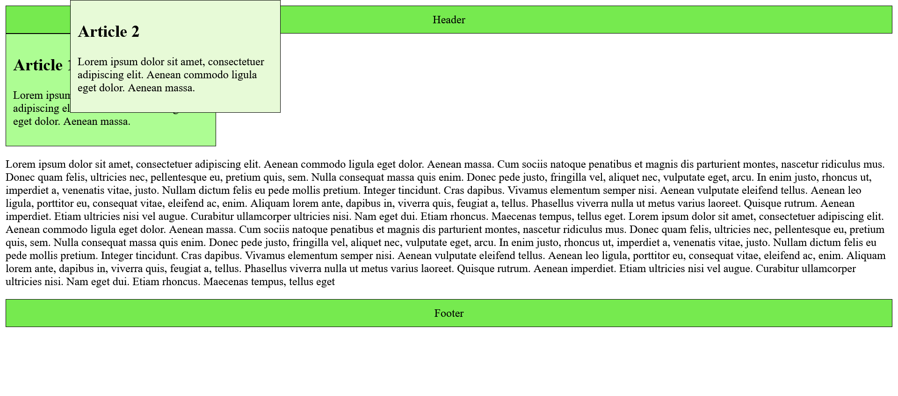

Note: If the width of a block is not specified and the positioning `position: absolute;` is used, this absolutely positioned element will only be displayed as wide as the inline value.

In practice, absolute and relative positioning are often combined.

 [Complete Code](https://github.com/BellaMrx/CSS_Guide_Part_2/blob/main/5_CSS_Positioning/Part_4) --> *5_CSS_Positioning/Part_4/index.html*
   ```
    <body>
        <figure>
            
            <figcaption>Whale in clouds</figcaption>
        </figure>
    </body>
   ```


 [Complete Code](https://github.com/BellaMrx/CSS_Guide_Part_2/blob/main/5_CSS_Positioning/Part_4) --> *5_CSS_Positioning/Part_4/styles/style.css*
   ```
    figure {
        position: relative;
        width: 400px;
        box-shadow: 4px 6px 22px 1px rgba(0, 0, 0, 0.75);
    }

    figcaption {
        position: absolute;
        left: 0;
        top: 0;
        width: 100%;
        text-align: center;
        color: white;
        background: rgba(28, 90, 100, 0.7);
        padding: 0.75rem;
    }

    figure img {
        display: block;
    }
   ```

 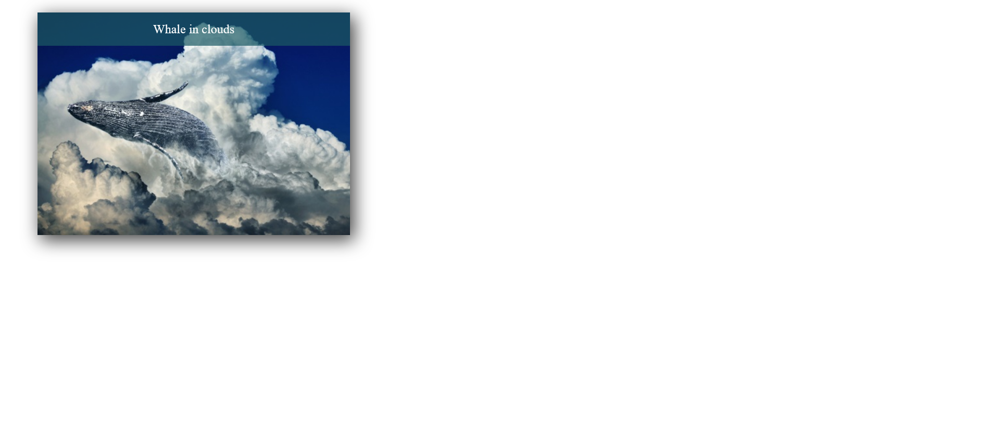


### `position: fixed;`
The fixed positioning behaves at first like the absolute positioning, however with the clear difference that this fixed position is measured absolutely to the left upper edge of the web browser window. This means that a fixed element does not move when the web browser window is scrolled.

 [Complete Code](https://github.com/BellaMrx/CSS_Guide_Part_2/blob/main/5_CSS_Positioning/Part_5) --> *5_CSS_Positioning/Part_5/index.html*
   ```
    <header class="foothead">Header</header>
    <article class="article01">
        <h1>Article 1</h1>
        <p>Lorem ipsum dolor sit amet, consectetuer adipiscing elit. Aenean commodo ligula eget dolor. Aenean massa. </p>
    </article>
    <article class="article02">
        <h1>Article 2</h1>
        <p>Lorem ipsum dolor sit amet, consectetuer adipiscing elit. Aenean commodo ligula eget dolor. Aenean massa. </p>
    </article>
    <p>Lorem ipsum dolor sit amet, consectetuer adipiscing elit. Aenean ... </p>
    <p>Lorem ipsum dolor sit amet, consectetuer adipiscing elit. Aenean ... </p>
    <p>Lorem ipsum dolor sit amet, consectetuer adipiscing elit. Aenean ... </p>
    <p>Lorem ipsum dolor sit amet, consectetuer adipiscing elit. Aenean ... </p>
    <footer class="foothead">Footer</footer>
   ```


 [Complete Code](https://github.com/BellaMrx/CSS_Guide_Part_2/blob/main/5_CSS_Positioning/Part_5) --> *5_CSS_Positioning/Part_5/styles/style.css*
   ```
    .article01 {
        position: static;
        width: 300px;
        padding: 10px;
        border: 1px solid black;
        background-color: #adfd93;
    }

    .article02 {
        position: fixed;
        top: 0;
        left: 100px;
        width: 300px;
        padding: 10px;
        border: 1px solid black;
        background-color: #e7fad7;
    }
   ```
 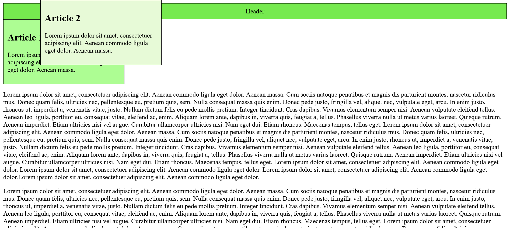

 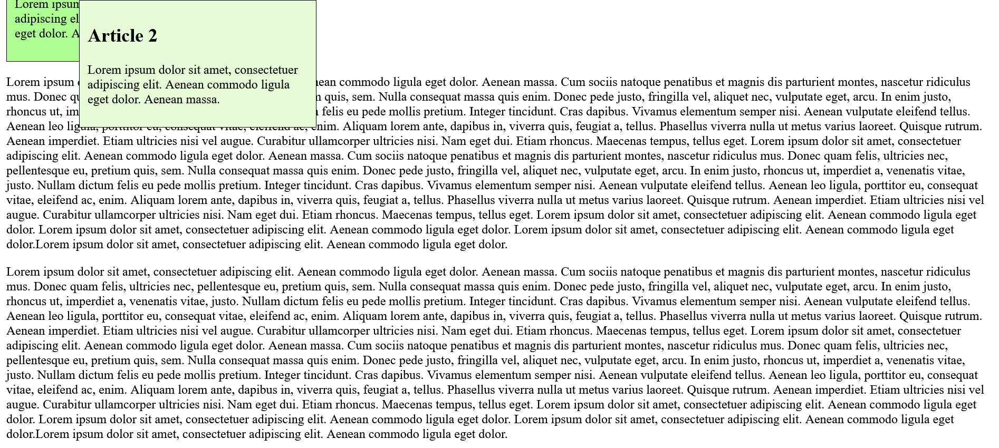

In practice, a fixed positioning is suitable e.g. for navigation areas, a fixed header or footer or a fixed link to the top of the page, which is always present at the same position.

 [Complete Code](https://github.com/BellaMrx/CSS_Guide_Part_2/blob/main/5_CSS_Positioning/Part_6) --> *5_CSS_Positioning/Part_6/index.html*
   ```
    <h1 id="start">Top of the page</h1>
    <a href="#start" class="up">Up</a>
    <p>Lorem ipsum dolor sit amet, consectetuer adipiscing elit. Aenean ...</p>
    <p>Lorem ipsum dolor sit amet, consectetuer adipiscing elit. Aenean ...</p>
    <p>Lorem ipsum dolor sit amet, consectetuer adipiscing elit. Aenean ...</p>
    <p>Lorem ipsum dolor sit amet, consectetuer adipiscing elit. Aenean ... </p>
    <p>Lorem ipsum dolor sit amet, consectetuer adipiscing elit. Aenean ... </p>
    <p>Lorem ipsum dolor sit amet, consectetuer adipiscing elit. Aenean ... </p>
   ```


 [Complete Code](https://github.com/BellaMrx/CSS_Guide_Part_2/blob/main/5_CSS_Positioning/Part_6) --> *5_CSS_Positioning/Part_6/styles/style.css*
   ```
    .up {
        position: fixed;
        bottom: 20px;
        right: 20px;
        padding: 15px;
        border: 4px solid #76ea4f;
        background-color: #adfd93;
        color: black;
    }
   ```
 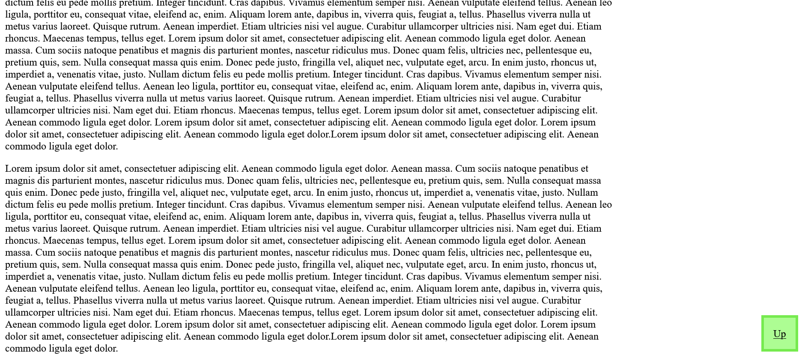


### `position: sticky;`
This function is a hybrid of relative and fixed positioning. This element initially behaves as with relative positioning until a certain boundary such as the top or bottom of the screen has been reached, where the element then sticks, and behaves as with fixed positioning.

 [Complete Code](https://github.com/BellaMrx/CSS_Guide_Part_2/blob/main/5_CSS_Positioning/Part_7) --> *5_CSS_Positioning/Part_7/index.html*
   ```
    <header class="foothead">Header</header>
    <article class="article01">
        <h1 class="sticky_h1">Article 1</h1>
        <p>Lorem ipsum dolor sit amet, consectetuer adipiscing elit. Aenean ...</p>
        <p>Lorem ipsum dolor sit amet, consectetuer adipiscing elit. Aenean ... </p>
        <p>Lorem ipsum dolor sit amet, consectetuer adipiscing elit. Aenean ... </p>
        <p>Lorem ipsum dolor sit amet, consectetuer adipiscing elit. Aenean ... </p>
        <p>Lorem ipsum dolor sit amet, consectetuer adipiscing elit. Aenean ... </p>

    </article>
    <article class="article02">
        <h1 class="sticky_h1">Article 2</h1>
        <p>Lorem ipsum dolor sit amet, consectetuer adipiscing elit. Aenean ... </p>
        <p>Lorem ipsum dolor sit amet, consectetuer adipiscing elit. Aenean ... </p>
        <p>Lorem ipsum dolor sit amet, consectetuer adipiscing elit. Aenean ...</p>
        <p>Lorem ipsum dolor sit amet, consectetuer adipiscing elit. Aenean ... </p>
        <p>Lorem ipsum dolor sit amet, consectetuer adipiscing elit. Aenean ... </p>
        <p>Lorem ipsum dolor sit amet, consectetuer adipiscing elit. Aenean ... </p>
        <p>Lorem ipsum dolor sit amet, consectetuer adipiscing elit. Aenean ... </p>

    </article>
    <footer class="foothead">Footer</footer>
   ```


 [Complete Code](https://github.com/BellaMrx/CSS_Guide_Part_2/blob/main/5_CSS_Positioning/Part_7) --> *5_CSS_Positioning/Part_7/styles/style.css*
   ```
    .article01 {
        position: static;
        width: 100%;
        padding: 10px;
        border: 1px solid black;
        background-color: #adfd93;
    }

    .article02 {
        position: static;
        width: 100%;
        padding: 10px;
        border: 1px solid black;
        background-color: #e7fad7;
    }

    .sticky_h1 {
        position: -webkit-sticky;
        position: sticky;
        top: -1px; 
        width: 100%;
        background-color: black;
        color: white;
    }
   ```
 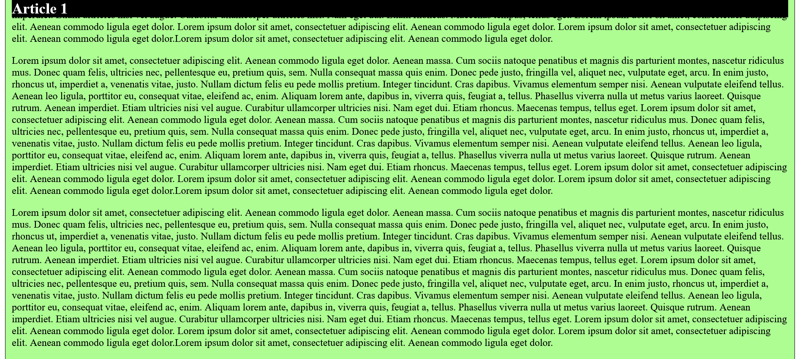


### Placement of elements with `top`, `right`, `bottom` and `left`
These four properties are additionally used for the CSS property `position`. This specifies whether an absolutely or relatively positioned element starts at the top, right, bottom and/or left. In a normal positioning with `position: static;`, specifications with the CSS properties `top`, `right`, `bottom` and `left` have no effect. Units for `top`, `right`, `bottom` and `left` are `px`, `%` or `em`.
Only one of the properties `top` or `bottom` should be used, as well as `left` and `right`. The default value of all four CSS properties is `auto`.


## 5.2. Stacking with `z-index` 
By default, the relative, absolute, and fixed elements are stacked in the order they were noted in the document flow of the HTML document. The last element noted is on top. This behavior can be changed with the CSS property `z-index`. The z-axis is the third dimension on which the elements are stacked.

The use of the CSS property `z-index` is simple. The higher the noted value of `z-index`, the higher up the element is in the stack. Thus, the element with the highest `z-index` value is at the top and the element with the lowest `z-index` value is at the bottom. If the `z-index` values are equal, the element that was last noted in the document flow is at the top.

Negative values can also be used for the `z-index`. Of course, it still applies here that elements with positive values are arranged above the elements with negative values.

 [Complete Code](https://github.com/BellaMrx/CSS_Guide_Part_2/blob/main/5_CSS_Positioning/Part_8) --> *5_CSS_Positioning/Part_8/index.html*
   ```
    <header class="foothead">Header</header>
      <article class="article01">
        <h1>Article 1</h1>
        <p>Lorem ipsum dolor sit amet, consectetuer adipiscing elit. Aenean commodo ligula eget dolor. Aenean massa. </p>
      </article>
      <article class="article02">
        <h1>Article 2</h1>
        <p>Lorem ipsum dolor sit amet, consectetuer adipiscing elit. Aenean commodo ligula eget dolor. Aenean massa. </p>
      </article>
      <p>Lorem ipsum dolor sit amet, consectetuer adipiscing elit. Aenean ... </p>
    <footer class="foothead">Footer</footer>
   ```


 [Complete Code](https://github.com/BellaMrx/CSS_Guide_Part_2/blob/main/5_CSS_Positioning/Part_8) --> *5_CSS_Positioning/Part_8/styles/style.css*
   ```
    .article01 {
        position: relative;
        width: 300px;
        padding: 10px;
        border: 1px solid black;
        background-color: #adfd93;
        z-index: 2;
    }

    .article02 {
        position: relative;
        top: -75px;
        left: 100px;
        width: 300px;
        padding: 10px;
        border: 1px solid black;
        background-color: #e7fad7;
        z-index: 1;
    }
   ```
 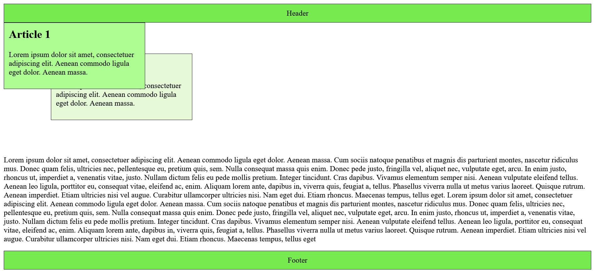


## 5.3. Floating boxes with `float`
With `float` an element is taken out of the usual document flow and placed at the right or left margin. The following elements without `float` flow around this floated element. In practice, people tend to use flexboxes or the grid layout for the layout of websites today. 

 [Complete Code](https://github.com/BellaMrx/CSS_Guide_Part_2/blob/main/5_CSS_Positioning/Part_9) --> *5_CSS_Positioning/Part_9/index.html*
   ```
    <h1>A report</h1>
    <figure>
        
        <figcaption>A picture</figcaption>
    </figure>
    <p>Lorem ipsum dolor sit amet, consectetuer adipiscing elit. Aenean ... </p>

    <p>Lorem ipsum dolor sit amet, consectetuer adipiscing elit. Aenean ... </p>
    <p>Lorem ipsum dolor sit amet, consectetuer adipiscing elit. Aenean ... </p>
   ```


 [Complete Code](https://github.com/BellaMrx/CSS_Guide_Part_2/blob/main/5_CSS_Positioning/Part_9) --> *5_CSS_Positioning/Part_9/styles/style.css*
   ```
    figure {
        float: left;
        margin: 0 0 0 1rem;
    }
   ```
 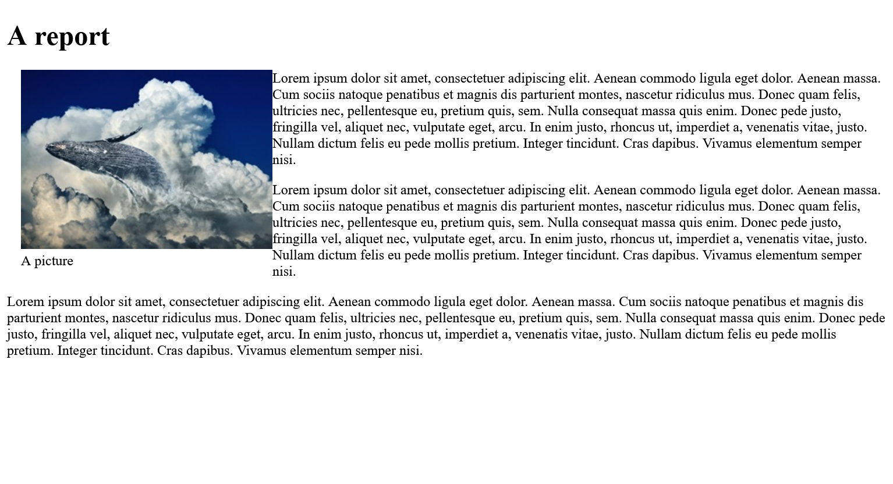


In addition to `left` and `right`, the values `none` (default) and `inherit` can also be used for `float`. `none` indicates that the element should not be floated. With `inherit`, on the other hand, the element takes over the `float` value of the parent element in which it resides.

Floating elements works only horizontally. The elements can only flow around to the left or to the right.

Only the text around the image flows, but not the `padding`, `border`, `margin` and `background` properties. These remain behind the floated image.


### Stop flowing around
The flowing around can be stopped with the CSS property `clear`. The CSS property `clear` can be passed the values `left`, `right`, `both` or `none`. A `clear:left;` ends a `float:left;` and `both` ends left and right. `none` is the default value, and the elements can thus flow again. 

 [Complete Code](https://github.com/BellaMrx/CSS_Guide_Part_2/blob/main/5_CSS_Positioning/Part_10) --> *5_CSS_Positioning/Part_10/index.html*
   ```
    <h1>A report</h1>
    <figure>
        
        <figcaption>A picture</figcaption>
    </figure>
    <p>Lorem ipsum dolor sit amet, consectetuer adipiscing elit. Aenean ... </p>

    <p>Lorem ipsum dolor sit amet, consectetuer adipiscing elit. Aenean ... </p>
    <p>Lorem ipsum dolor sit amet, consectetuer adipiscing elit. Aenean ... </p>
   ```


 [Complete Code](https://github.com/BellaMrx/CSS_Guide_Part_2/blob/main/5_CSS_Positioning/Part_10) --> *5_CSS_Positioning/Part_10/styles/style.css*
   ```
    figure {
        float: left;
        margin: 0 0 0 1rem;
    }
   ```
 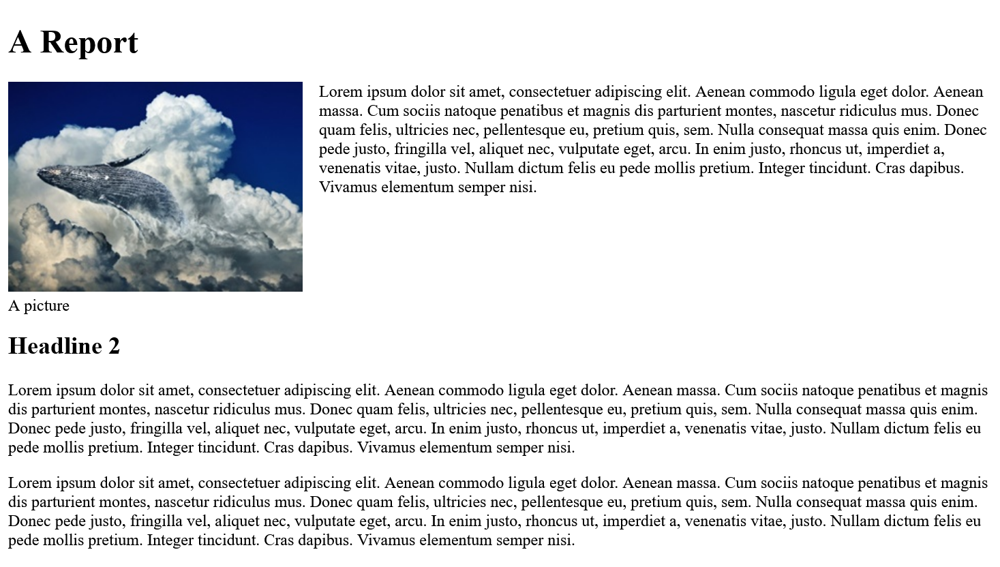


### Combine floats into a unit
With `display: flow-root;` a new block for the bypassing element is created via CSS. This element is only available to newer web browsers. For this the trick with `overflow: hidden;` would offer itself, with which as a side effect likewise the content is enclosed into a new block. An elegant solution for this is CSS's feature query @supports(). This can be used to check whether a browser can handle certain CSS property-value combinations.

 [Complete Code](https://github.com/BellaMrx/CSS_Guide_Part_2/blob/main/5_CSS_Positioning/Part_11) --> *5_CSS_Positioning/Part_11/index.html*
   ```
    <h1>A report</h1>
    <figure>
        
        <figcaption>A picture</figcaption>
    </figure>
    <p>Lorem ipsum dolor sit amet, consectetuer adipiscing elit. Aenean ... </p>

    <p>Lorem ipsum dolor sit amet, consectetuer adipiscing elit. Aenean ... </p>
    <p>Lorem ipsum dolor sit amet, consectetuer adipiscing elit. Aenean ... </p>
   ```


 [Complete Code](https://github.com/BellaMrx/CSS_Guide_Part_2/blob/main/5_CSS_Positioning/Part_11) --> *5_CSS_Positioning/Part_11/styles/style.css*
   ```
    .float-left {
        float: left;
        margin: 0 1rem 1rem 0;
    }
    
    .head-foot {
        background-color: grey;
        padding: 2rem;
        text-align: center;
        color: white;
    }
    
    .article-bg {
        background-color: lightgrey;
        overflow: hidden;
    }
    
    @supports(display: flow-root) {
        .article-bg {
            display: flow-root;
            overflow: initial;
            background-color: lightgrey;
        }
    }
   ```
 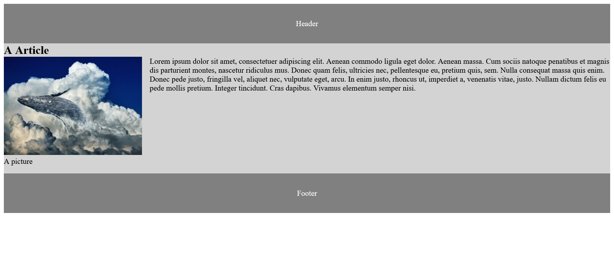


## 5.4. Flexible boxes (flexbox model)
Responsive web design is an indispensable part of creating websites today, so the desire for a simpler and better alternative to float positioning has become greater. One of these alternatives is the flexbox model. The CSS flexbox is perfect for arranging elements next to or below each other. This is very handy for galleries or links of a navigation, for example, because CSS flexboxes offer even more options, including arranging the elements neatly next to each other with a certain spacing, in a certain order, or in a certain size.

The principle of flexboxes is simple. A parent element is needed in which the CSS property `display` is set to `flex`. This property affects all contained child elements. The parent element that has the `display:flex;` CSS property set is also called a flex container. The child elements it contains are the flex items.


### Align the flexbox
How the elements are aligned within the flexbox is specified with the CSS property `flex-direction`. For horizontal alignment the value `row` can be used and for vertical alignment the value `column` is used. If `flex-direction` is not used, `row` is the default. The default orientation for the elements of a flexbox is horizontal.

 [Complete Code](https://github.com/BellaMrx/CSS_Guide_Part_2/blob/main/5_CSS_Positioning/Part_12) --> *5_CSS_Positioning/Part_12/index.html*
   ```
    <main class="mymain">
        <article class="myarticle">
            <h1>Article 1</h1>
            <p>Lorem ipsum dolor sit amet, consectetuer adipiscing elit. </p>
        </article>
        <article class="myarticle">
            <h1>Article 2</h1>
            <p>Lorem ipsum dolor sit amet, consectetuer adipiscing elit. Lorem ipsum dolor sit amet, consectetuer adipiscing elit.</p>
        </article>
        <article class="myarticle">
            <h1>Article 3</h1>
            <p>Lorem ipsum dolor sit amet, consectetuer adipiscing elit. Lorem ipsum dolor sit amet, consectetuer adipiscing elit. </p>
        </article>
    </main>
   ```


 [Complete Code](https://github.com/BellaMrx/CSS_Guide_Part_2/blob/main/5_CSS_Positioning/Part_12) --> *5_CSS_Positioning/Part_12/styles/style.css*
   ```
    .myarticle {
        width: 300px;
        padding: 10px;
        margin: 0px 5px 5px 0px;
        border: 1px solid black;
        background-color: #e7fad7;
    }

    .mymain {
        width: 95%;
        padding: 10px;
        background-color: #76ea4f;
        display: flex;
        flex-direction: row;
    }
   ```
 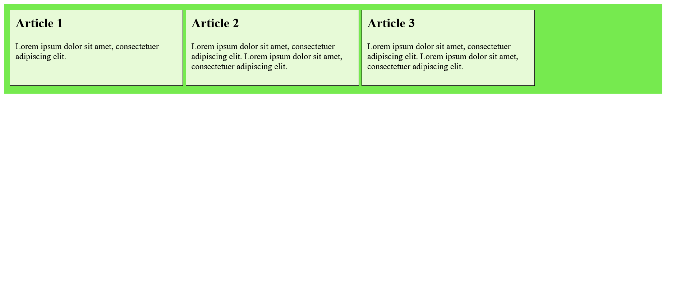


If the value `column` is used instead of `row`, the individual elements within the `main` element are vertically aligned.

 [Complete Code](https://github.com/BellaMrx/CSS_Guide_Part_2/blob/main/5_CSS_Positioning/Part_13) --> *5_CSS_Positioning/Part_13/index.html*
   ```
    <main class="mymain">
        <article class="myarticle">
            <h1>Article 1</h1>
            <p>Lorem ipsum dolor sit amet, consectetuer adipiscing elit. </p>
        </article>
        <article class="myarticle">
            <h1>Article 2</h1>
            <p>Lorem ipsum dolor sit amet, consectetuer adipiscing elit. Lorem ipsum dolor sit amet, consectetuer adipiscing elit.</p>
        </article>
        <article class="myarticle">
            <h1>Article 3</h1>
            <p>Lorem ipsum dolor sit amet, consectetuer adipiscing elit. Lorem ipsum dolor sit amet, consectetuer adipiscing elit. </p>
        </article>
    </main>
   ```


 [Complete Code](https://github.com/BellaMrx/CSS_Guide_Part_2/blob/main/5_CSS_Positioning/Part_13) --> *5_CSS_Positioning/Part_13/styles/style.css*
   ```
    .myarticle {
        width: 300px;
        padding: 10px;
        margin: 0px 5px 5px 0px;
        border: 1px solid black;
        background-color: #e7fad7;
    }

    .mymain {
        width: 95%;
        padding: 10px;
        background-color: #76ea4f;
        display: flex;
        flex-direction: row;
    }
   ```
 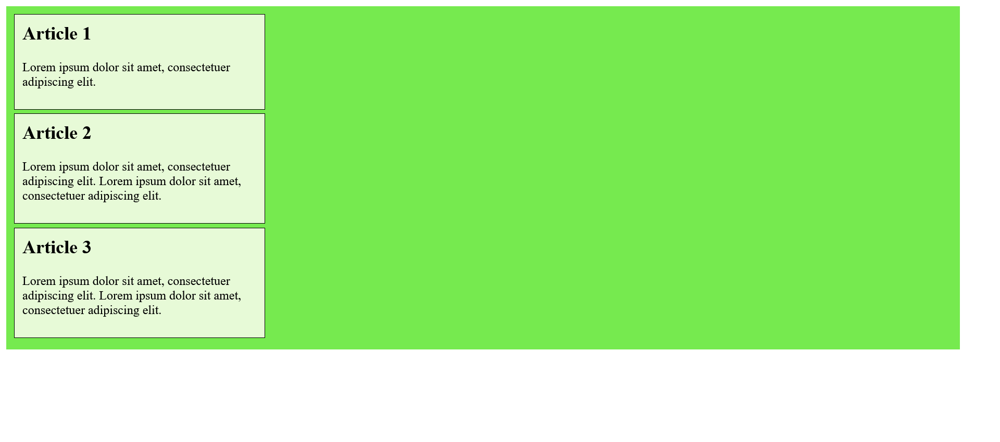


For the CSS properties `flex-direction`, the values `row-reverse` and `column-reverse` can be used, with which the elements are sorted and displayed in reverse order.


#### Wrap elements in a flexbox with `flex-wrap`
The unpleasant thing about `flex-direction: row;` is that it doesn't look nice above a certain window width.

 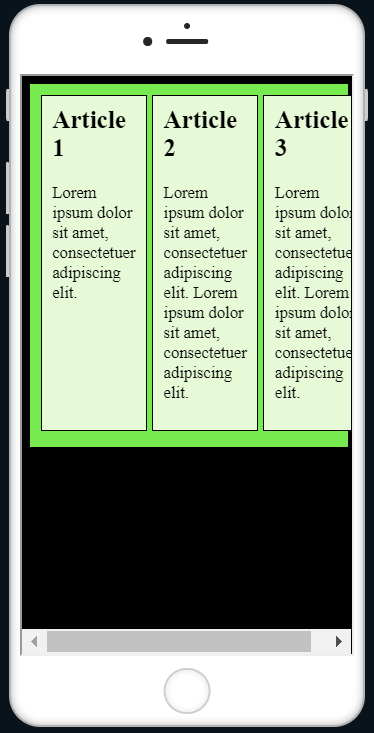


If you want the elements to wrap to the next row, the flexbox model provides the CSS property `flex-wrap`. The default value `nowrap` prevents the elements in the flexbox from wrapping. If the `wrap` value is used, the elements wrap into a new row. There is also the value `wrap-reverse`, which wraps the flexible elements to the top.

 [Complete Code](https://github.com/BellaMrx/CSS_Guide_Part_2/blob/main/5_CSS_Positioning/Part_14) --> *5_CSS_Positioning/Part_14/index.html*
   ```
    <main class="mymain">
        <article class="myarticle">
            <h1>Article 1</h1>
            <p>Lorem ipsum dolor sit amet, consectetuer adipiscing elit. </p>
        </article>
        <article class="myarticle">
            <h1>Article 2</h1>
            <p>Lorem ipsum dolor sit amet, consectetuer adipiscing elit. Lorem ipsum dolor sit amet, consectetuer adipiscing elit.</p>
        </article>
        <article class="myarticle">
            <h1>Article 3</h1>
            <p>Lorem ipsum dolor sit amet, consectetuer adipiscing elit. Lorem ipsum dolor sit amet, consectetuer adipiscing elit. </p>
        </article>
    </main>
   ```


 [Complete Code](https://github.com/BellaMrx/CSS_Guide_Part_2/blob/main/5_CSS_Positioning/Part_14) --> *5_CSS_Positioning/Part_14/styles/style.css*
   ```
    .myarticle {
        width: 300px;
        padding: 10px;
        margin: 0px 5px 5px 0px;
        border: 1px solid black;
        background-color: #e7fad7;
    }

    .mymain {
        width: 95%;
        padding: 10px;
        background-color: #76ea4f;
        display: flex;
        flex-direction: row;
        flex-wrap: wrap;
    }
   ```
 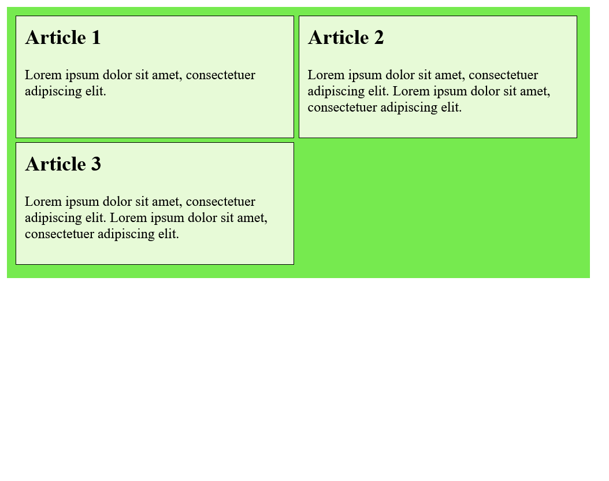

 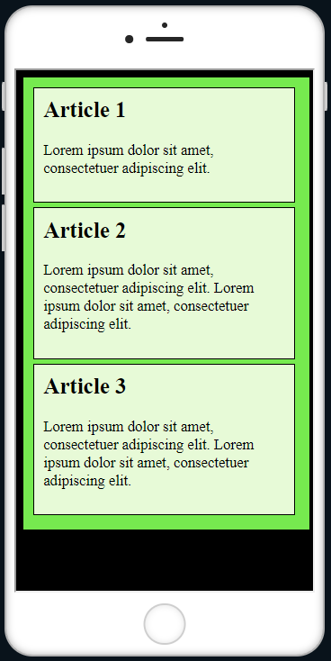


The shorthand notation for `flex-direction` and `flex-wrap` is possible with `flex-flow`, e.g :
    `flex-flow: row-wrap;`
is equivalent to the notation:
   ```
	flex-direction: row;
	flex-wrap: wrap;
   ```

#### Arrange elements along the main axis with `justify-content`
The CSS property `justify-content` can be used to arrange the individual elements along the main axis. Possible values for this are `center`, `flex-start`, `flex-end`, `space-between` and `space-around`.

- `center` : This will place the elements in the center.

 [Complete Code](https://github.com/BellaMrx/CSS_Guide_Part_2/blob/main/5_CSS_Positioning/Part_15) --> *5_CSS_Positioning/Part_15/index.html*
   ```
    <main class="mymain">
        <article class="myarticle">
            <h1>Article 1</h1>
            <p>Lorem ipsum dolor sit amet, consectetuer adipiscing elit. </p>
        </article>
        <article class="myarticle">
            <h1>Article 2</h1>
            <p>Lorem ipsum dolor sit amet, consectetuer adipiscing elit. Lorem ipsum dolor sit amet, consectetuer adipiscing elit.</p>
        </article>
        <article class="myarticle">
            <h1>Article 3</h1>
            <p>Lorem ipsum dolor sit amet, consectetuer adipiscing elit. Lorem ipsum dolor sit amet, consectetuer adipiscing elit. </p>
        </article>
    </main>
   ```


 [Complete Code](https://github.com/BellaMrx/CSS_Guide_Part_2/blob/main/5_CSS_Positioning/Part_15) --> *5_CSS_Positioning/Part_15/styles/style1.css*
   ```
    .myarticle {
        width: 300px;
        padding: 10px;
        margin: 0px 5px 5px 0px;
        border: 1px solid black;
        background-color: lightgreen;
    }

    .mymain {
        width: 98%;
        padding: 10px;
        background-color: green;
        display: flex;
        justify-content: center;
    }
   ```
 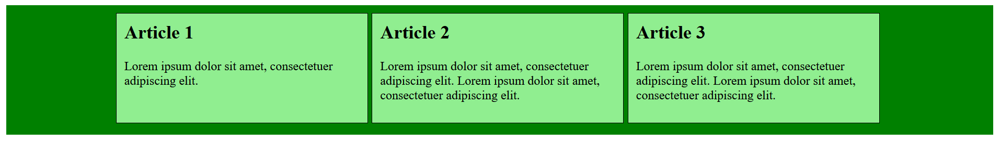


- `flex-start` : This will align the elements left.

 [Complete Code](https://github.com/BellaMrx/CSS_Guide_Part_2/blob/main/5_CSS_Positioning/Part_15) --> *5_CSS_Positioning/Part_15/styles/style2.css*
   ```
    .myarticle {
        width: 300px;
        padding: 10px;
        margin: 0px 5px 5px 0px;
        border: 1px solid black;
        background-color: lightgreen;
    }

    .mymain {
        width: 98%;
        padding: 10px;
        background-color: green;
        display: flex;
        justify-content: flex-start;
    }
   ```
 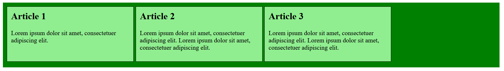


- `flex-end` : This will align the elements right.

 [Complete Code](https://github.com/BellaMrx/CSS_Guide_Part_2/blob/main/5_CSS_Positioning/Part_15) --> *5_CSS_Positioning/Part_15/styles/style3.css*
   ```
    .myarticle {
        width: 300px;
        padding: 10px;
        margin: 0px 5px 5px 0px;
        border: 1px solid black;
        background-color: lightgreen;
    }

    .mymain {
        width: 98%;
        padding: 10px;
        background-color: green;
        display: flex;
        justify-content: flex-end;
    }
   ```
 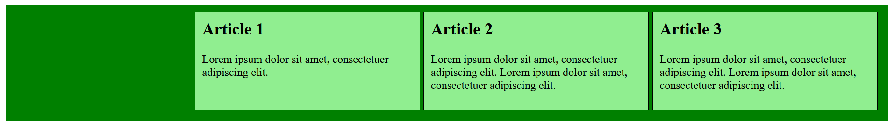


 - `space-between` : This distributes the elements evenly. The first and the last element touches at the beginning or at the end.
 
 [Complete Code](https://github.com/BellaMrx/CSS_Guide_Part_2/blob/main/5_CSS_Positioning/Part_15) --> *5_CSS_Positioning/Part_15/styles/style4.css*
   ```
    .myarticle {
        width: 300px;
        padding: 10px;
        margin: 0px 5px 5px 0px;
        border: 1px solid black;
        background-color: lightgreen;
    }

    .mymain {
        width: 98%;
        padding: 10px;
        background-color: green;
        display: flex;
        justify-content: space-between;
    }
   ```
 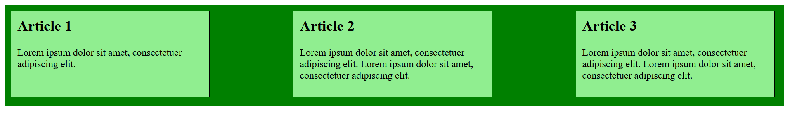


  - `space-around` : This distributes all elements evenly.
 
 [Complete Code](https://github.com/BellaMrx/CSS_Guide_Part_2/blob/main/5_CSS_Positioning/Part_15) --> *5_CSS_Positioning/Part_15/styles/style5.css*
   ```
    .myarticle {
        width: 300px;
        padding: 10px;
        margin: 0px 5px 5px 0px;
        border: 1px solid black;
        background-color: lightgreen;
    }

    .mymain {
        width: 98%;
        padding: 10px;
        background-color: green;
        display: flex;
        justify-content: space-around;
    }
   ```
 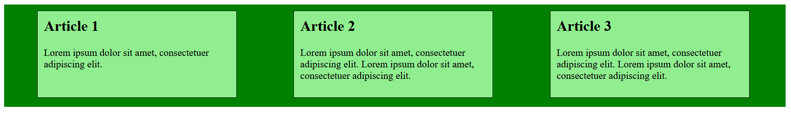


#### Arrange elements along the cross axis with `align-content`
If the elements are to be arranged along the cross axis, the CSS property `align-content` is used. The default value is `stretch`, which distributes all elements evenly. Other values are `center`, `flex-start`, `flex-end`, `space-between` and `space-around`.

- `center`

 [Complete Code](https://github.com/BellaMrx/CSS_Guide_Part_2/blob/main/5_CSS_Positioning/Part_16) --> *5_CSS_Positioning/Part_16/index.html*
   ```
    <main class="mymain">
        <article class="myarticle">
            <h1>Article 1</h1>
            <p>Lorem ipsum dolor sit amet, consectetuer adipiscing elit. </p>
        </article>
        <article class="myarticle">
            <h1>Article 2</h1>
            <p>Lorem ipsum dolor sit amet, consectetuer adipiscing elit.</p>
        </article>
        <article class="myarticle">
            <h1>Article 3</h1>
            <p>Lorem ipsum dolor sit amet, consectetuer adipiscing elit.</p>
        </article>
    </main>
   ```


 [Complete Code](https://github.com/BellaMrx/CSS_Guide_Part_2/blob/main/5_CSS_Positioning/Part_16) --> *5_CSS_Positioning/Part_16/styles/style1.css*
   ```
    .myarticle {
        width: 500px;
        padding: 10px;
        margin: 0px 5px 5px 0px;
        border: 1px solid black;
        background-color: lightgreen;
    }

    .mymain {
        width: 95%;
        height: 400px;
        padding: 10px;
        background-color: green;
        display: flex;
        flex-wrap: wrap;
        align-content: center;
    }
   ```
 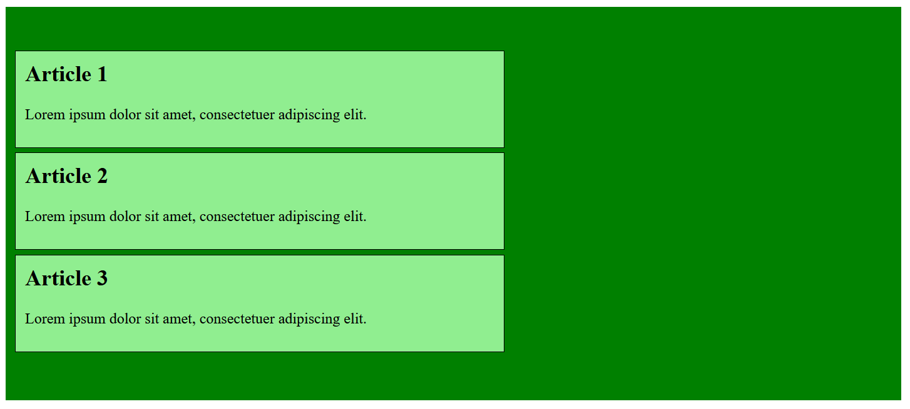


- `flex-start`

 [Complete Code](https://github.com/BellaMrx/CSS_Guide_Part_2/blob/main/5_CSS_Positioning/Part_16) --> *5_CSS_Positioning/Part_16/styles/style2.css*
   ```
    .myarticle {
        width: 500px;
        padding: 10px;
        margin: 0px 5px 5px 0px;
        border: 1px solid black;
        background-color: lightgreen;
    }

    .mymain {
        width: 95%;
        height: 400px;
        padding: 10px;
        background-color: green;
        display: flex;
        flex-wrap: wrap;
        align-content: flex-start;
    }
   ```
 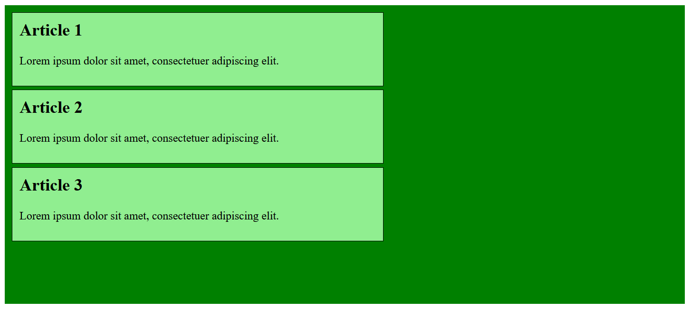


- `flex-end`

 [Complete Code](https://github.com/BellaMrx/CSS_Guide_Part_2/blob/main/5_CSS_Positioning/Part_16) --> *5_CSS_Positioning/Part_16/styles/style3.css*
   ```
    .myarticle {
        width: 500px;
        padding: 10px;
        margin: 0px 5px 5px 0px;
        border: 1px solid black;
        background-color: lightgreen;
    }

    .mymain {
        width: 95%;
        height: 400px;
        padding: 10px;
        background-color: green;
        display: flex;
        flex-wrap: wrap;
        align-content: flex-end;
    }
   ```
 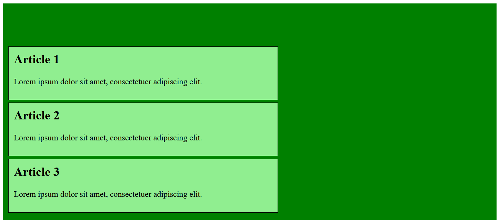


- `space-between`

 [Complete Code](https://github.com/BellaMrx/CSS_Guide_Part_2/blob/main/5_CSS_Positioning/Part_16) --> *5_CSS_Positioning/Part_16/styles/style4.css*
   ```
    .myarticle {
        width: 500px;
        padding: 10px;
        margin: 0px 5px 5px 0px;
        border: 1px solid black;
        background-color: lightgreen;
    }

    .mymain {
        width: 95%;
        height: 400px;
        padding: 10px;
        background-color: green;
        display: flex;
        flex-wrap: wrap;
        align-content: space-between;
    }
   ```
 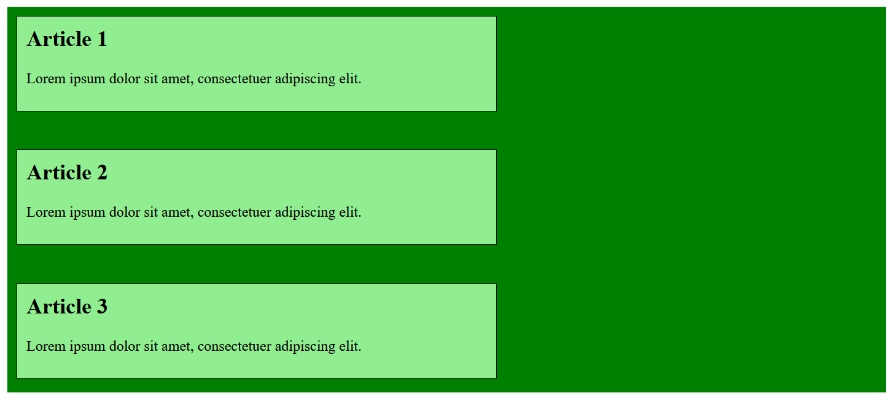


- `space-around`

 [Complete Code](https://github.com/BellaMrx/CSS_Guide_Part_2/blob/main/5_CSS_Positioning/Part_16) --> *5_CSS_Positioning/Part_16/styles/style5.css*
   ```
    .myarticle {
        width: 500px;
        padding: 10px;
        margin: 0px 5px 5px 0px;
        border: 1px solid black;
        background-color: lightgreen;
    }

    .mymain {
        width: 95%;
        height: 400px;
        padding: 10px;
        background-color: green;
        display: flex;
        flex-wrap: wrap;
        align-content: space-around;
    }
   ```
 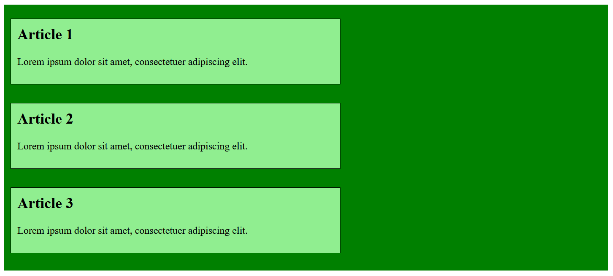


#### Arrange elements with `align-self`
If individual elements in the arrangement of flexible elements are to be assigned a different property than that specified in the parent element, the CSS property `align-self` can be used. The default value is the value of the parent element. Other possible values are `stretch`, `center`, `flex-start`, `flex-end` and `baseline` (which aligns an element to the baseline).

- `stretch`

 [Complete Code](https://github.com/BellaMrx/CSS_Guide_Part_2/blob/main/5_CSS_Positioning/Part_17) --> *5_CSS_Positioning/Part_17/index.html*
   ```
    <main class="mymain">
        <article class="myarticle">
            <h1>Article 1</h1>
            <p>Lorem ipsum dolor sit amet, consectetuer adipiscing elit. </p>
        </article>
        <article class="myarticle down">
            <h1>Article 2</h1>
            <p>Lorem ipsum dolor sit amet, consectetuer adipiscing elit. Lorem ipsum dolor sit amet, consectetuer adipiscing elit.</p>
        </article>
        <article class="myarticle">
            <h1>Article 3</h1>
            <p>Lorem ipsum dolor sit amet, consectetuer adipiscing elit. Lorem ipsum dolor sit amet, consectetuer adipiscing elit. </p>
        </article>
    </main>
   ```


 [Complete Code](https://github.com/BellaMrx/CSS_Guide_Part_2/blob/main/5_CSS_Positioning/Part_17) --> *5_CSS_Positioning/Part_17/styles/style1.css*
   ```
    .myarticle {
        width: 200px;
        height: 200px;
        padding: 10px;
        margin: 0px 5px 5px 0px;
        border: 1px solid black;
        background-color: lightgreen;
    }

    .mymain {
        width: 98%;
        height: 400px;
        padding: 10px;
        background-color: green;
        display: flex;
        flex-wrap: wrap;
        justify-content: flex-start;
    }

    .down {
        align-self: stretch;
    }
   ```
 


- `center`

 [Complete Code](https://github.com/BellaMrx/CSS_Guide_Part_2/blob/main/5_CSS_Positioning/Part_17/styles/style2.css) --> *5_CSS_Positioning/Part_17/styles/style2.css*
   ```
    .myarticle {
        width: 200px;
        height: 200px;
        padding: 10px;
        margin: 0px 5px 5px 0px;
        border: 1px solid black;
        background-color: lightgreen;
    }

    .mymain {
        width: 98%;
        height: 400px;
        padding: 10px;
        background-color: green;
        display: flex;
        flex-wrap: wrap;
        justify-content: flex-start;
    }

    .down {
        align-self: center;
    }
   ```
 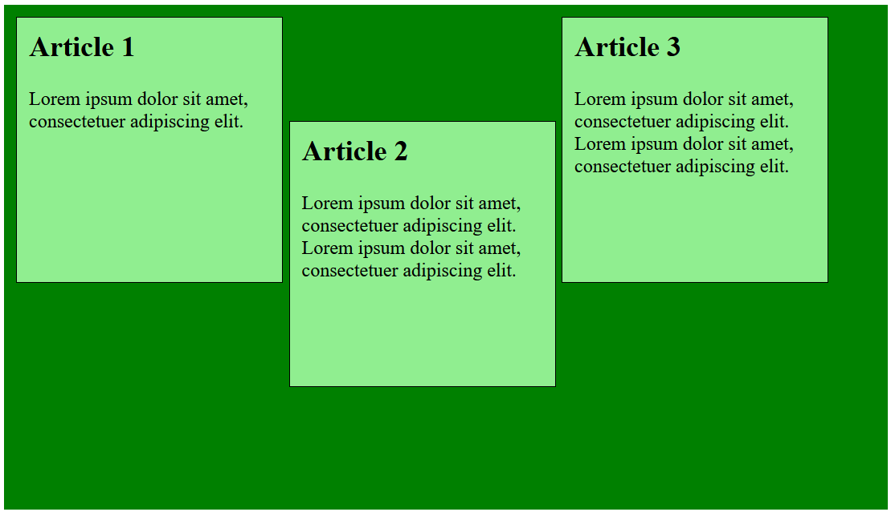


- `flex-start`

 [Complete Code](https://github.com/BellaMrx/CSS_Guide_Part_2/blob/main/5_CSS_Positioning/Part_17) --> *5_CSS_Positioning/Part_17/styles/style3.css*
   ```
    .myarticle {
        width: 200px;
        height: 200px;
        padding: 10px;
        margin: 0px 5px 5px 0px;
        border: 1px solid black;
        background-color: lightgreen;
    }

    .mymain {
        width: 98%;
        height: 400px;
        padding: 10px;
        background-color: green;
        display: flex;
        flex-wrap: wrap;
        justify-content: flex-start;
    }

    .down {
        align-self: flex-start;
    }
   ```
 


- `flex-end`

 [Complete Code](https://github.com/BellaMrx/CSS_Guide_Part_2/blob/main/5_CSS_Positioning/Part_17) --> *5_CSS_Positioning/Part_17/styles/style4.css*
   ```
    .myarticle {
        width: 200px;
        height: 200px;
        padding: 10px;
        margin: 0px 5px 5px 0px;
        border: 1px solid black;
        background-color: lightgreen;
    }

    .mymain {
        width: 98%;
        height: 400px;
        padding: 10px;
        background-color: green;
        display: flex;
        flex-wrap: wrap;
        justify-content: flex-start;
    }

    .down {
        align-self: flex-end;
    }
   ```
 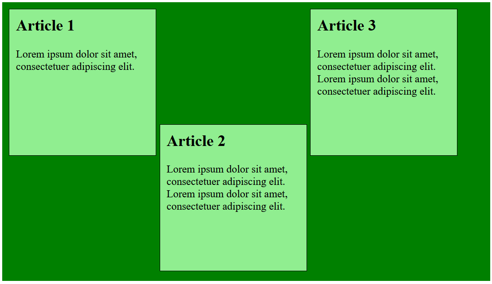


- `baseline`

 [Complete Code](https://github.com/BellaMrx/CSS_Guide_Part_2/blob/main/5_CSS_Positioning/Part_17) --> *5_CSS_Positioning/Part_17/styles/style5.css*
   ```
    .myarticle {
        width: 200px;
        height: 200px;
        padding: 10px;
        margin: 0px 5px 5px 0px;
        border: 1px solid black;
        background-color: lightgreen;
    }

    .mymain {
        width: 98%;
        height: 400px;
        padding: 10px;
        background-color: green;
        display: flex;
        flex-wrap: wrap;
        justify-content: flex-start;
    }

    .down {
        align-self: baseline;
    }
   ```
 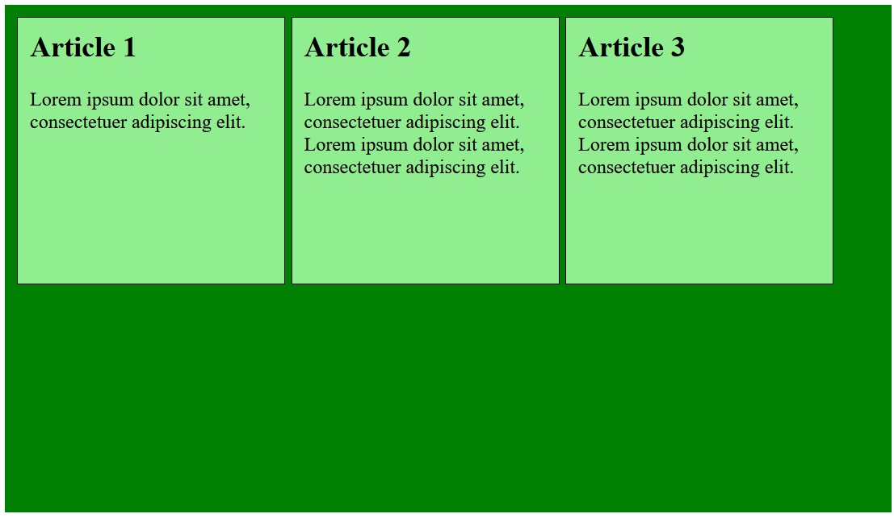


### Set flexibility of the flexbox
To set the flexibility of the corresponding elements within the flexbox, the CSS property `flex` is used. The property requires a numerical value. The numerical values behave relatively, meaning that an element with the specification `flex: 4;` is four times as flexible as an element with the property `flex: 1;`.

`flex-grow` controls how flexibly the element grows relative to the rest of the elements. How far the element shrinks relative to the other elements is specified with `flex-shrink`. The base width for the element is specified with `flex-basis`. In addition to percentages, px or em can also be specified. The default value for `flex-basis` is `auto`. The default value of `flex` in general is `flex: 0 1 auto;`.

The CSS property `flex` is a shorthand notation for existing CSS properties of flexboxes `flex-grow`, `flex-shrink` and `flex-base`. The `flex: 2;` is the shorthand notation for `flex-grow: 2;`.

The whole shorthand notation is for example:
`flex: 2 1 30%;`
This means:
   ```
    flex-grow: 2;
    flex-shrink: 1;
    flex-base: 30%;
   ```

 [Complete Code](https://github.com/BellaMrx/CSS_Guide_Part_2/blob/main/5_CSS_Positioning/Part_18) --> *5_CSS_Positioning/Part_18/index.html*
   ```
    <main class="mymain">
        <article class="myarticle article01">
            <h1>flex: 0 0 200px;</h1>
            <p>Lorem ipsum dolor sit amet, consectetuer adipiscing elit. </p>
        </article>
        <article class="myarticle article02">
            <h1>flex: 4 1 auto;</h1>
            <p>Lorem ipsum dolor sit amet, consectetuer adipiscing elit. Lorem ipsum dolor sit amet, consectetuer adipiscing elit.</p>
        </article>
        <article class="myarticle article03">
            <h1>flex: 1 3 150px;</h1>
            <p>Lorem ipsum dolor sit amet, consectetuer adipiscing elit. Lorem ipsum dolor sit amet, consectetuer adipiscing elit. </p>
        </article>
    </main>
   ```


 [Complete Code](https://github.com/BellaMrx/CSS_Guide_Part_2/blob/main/5_CSS_Positioning/Part_18) --> *5_CSS_Positioning/Part_18/styles/style.css*
   ```
    .myarticle {
        width: 300px;
        padding: 10px;
        margin: 0px 5px 5px 0px;
        border: 1px solid black;
        background-color: lightgreen;
    }

    .mymain {
        width: 90%;
        /* height: 200px; */
        padding: 10px;
        background-color: green;
        display: flex;
    }

    .article01 {
        flex: 0 0 200px;
    }

    .article02 {
        flex: 4 1 auto;
    }

    .article03 {
        flex: 1 3 150px;
    }
   ```
 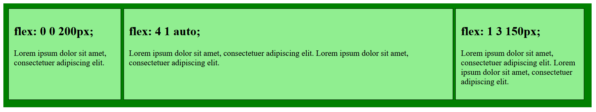

 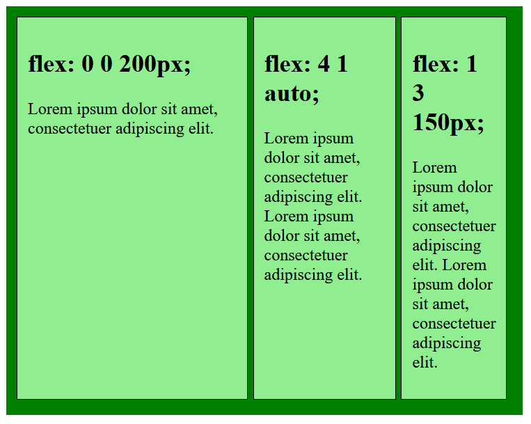


#### The peculiarity of flex-grow at line break

 [Complete Code](https://github.com/BellaMrx/CSS_Guide_Part_2/blob/main/5_CSS_Positioning/Part_19) --> *5_CSS_Positioning/Part_19/index.html*
   ```
    <main class="mymain">
        <article class="myarticle">
            <h1>Article 1</h1>
            <p>Lorem ipsum dolor sit amet, consectetuer adipiscing elit. </p>
        </article>
        <article class="myarticle">
            <h1>Article 2</h1>
            <p>Lorem ipsum dolor sit amet, consectetuer adipiscing elit. Lorem ipsum dolor sit amet, consectetuer adipiscing elit.</p>
        </article>
        <article class="myarticle">
            <h1>Article 3</h1>
            <p>Lorem ipsum dolor sit amet, consectetuer adipiscing elit. Lorem ipsum dolor sit amet, consectetuer adipiscing elit. </p>
        </article>
    </main>
   ```


 [Complete Code](https://github.com/BellaMrx/CSS_Guide_Part_2/blob/main/5_CSS_Positioning/Part_19) --> *5_CSS_Positioning/Part_19/styles/style.css*
   ```
    .myarticle {
        width: 300px;
        padding: 10px;
        margin: 0px 5px 5px 0px;
        border: 1px solid black;
        background-color: lightgreen;
        flex-grow: 1;
    }

    .mymain {
        width: 95%;
        padding: 10px;
        background-color: green;
        display: flex;
        flex-direction: row;
        flex-wrap: wrap;
    }
   ```
 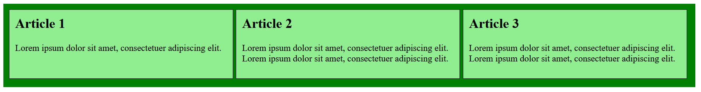

When the viewport is reduced, the elements are automatically arranged differently.

 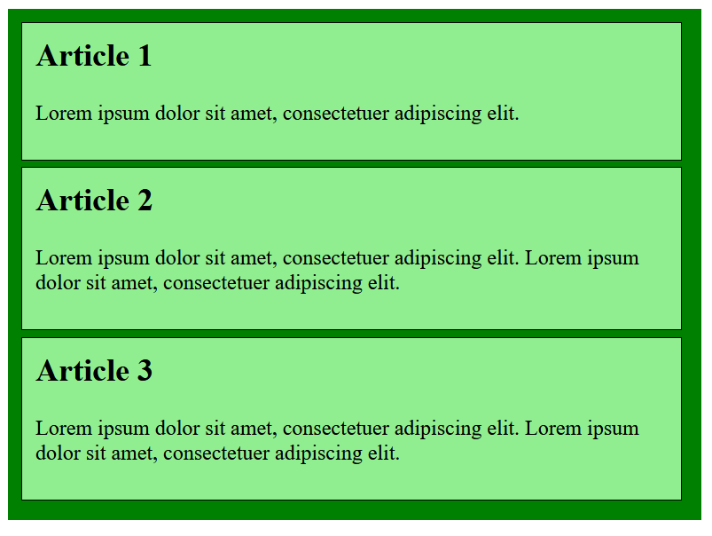

 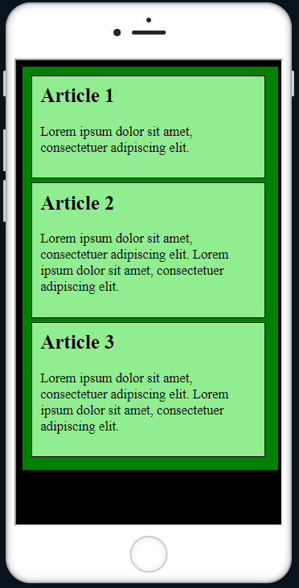


### Determine the order of the boxes
With the CSS property `order` the order itself can be set, also here a numerical value is used.

 [Complete Code](https://github.com/BellaMrx/CSS_Guide_Part_2/blob/main/5_CSS_Positioning/Part_20) --> *5_CSS_Positioning/Part_20/index.html*
   ```
    <main class="mymain">
      <article class="myarticle article01">
        <h1>Article 1</h1>
        <p>Lorem ipsum dolor sit amet, consectetuer adipiscing elit. </p>
      </article>
      <article class="myarticle article02">
        <h1>Article 2</h1>
        <p>Lorem ipsum dolor sit amet, consectetuer adipiscing elit. Lorem ipsum dolor sit amet, consectetuer adipiscing elit.</p>
      </article>
      <article class="myarticle article03">
        <h1>Article 3</h1>
        <p>Lorem ipsum dolor sit amet, consectetuer adipiscing elit. Lorem ipsum dolor sit amet, consectetuer adipiscing elit. </p>
      </article>
    </main>
   ```


 [Complete Code](https://github.com/BellaMrx/CSS_Guide_Part_2/blob/main/5_CSS_Positioning/Part_20) --> *5_CSS_Positioning/Part_20/styles/style.css*
   ```
    .myarticle {
        width: 300px;
        padding: 10px;
        margin: 0px 5px 5px 0px;
        border: 1px solid black;
        background-color: lightgreen;
    }

    .mymain {
        width: 90%;
        padding: 10px; 
        background-color: green;
        display: flex;
    }

    .article01 {  
        order: 2;  
    }

    .article02 {
        order: 3;  
    }

    .article03 {
        order: 1;  
    } 
   ```
 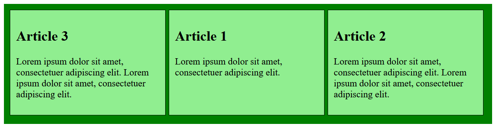


Simple examples for testing and studying CSS flexboxes can be found on the website [Quackit](http://quackit.com/css/flexbox/examples/).


-----------------------------------------------------------------------------------------------

This is the end of CSS Guide Part 2. You can find the next part here [CSS Guide Part III](https://github.com/BellaMrx/CSS_Guide_Part_3).

On my Twitter account [@bella_mrx](https://twitter.com/bella_mrx) you can find more useful stuff about HTML and web development. 

Or check out my [GitHub](https://github.com/BellaMrx) profile.


Thanks for reading. 
I hope you enjoyed it or at least learned something.